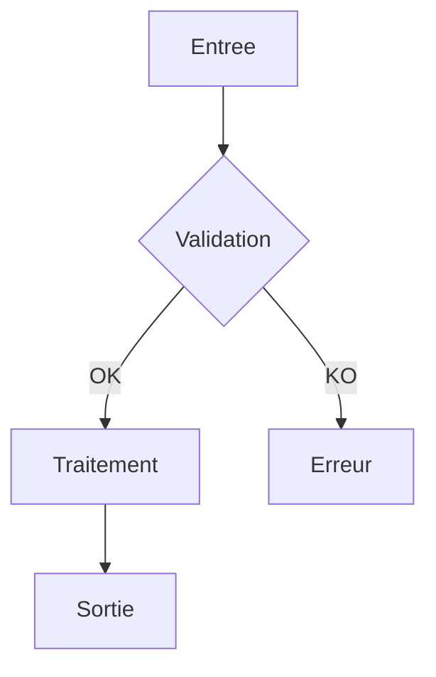

# Methodologie d'Audit de Code

> Structure en 6 phases sequentielles pour audits professionnels.

---

## Vue d'Ensemble

```
Phase 0    Phase 1      Phase 2       Phase 3    Phase 4     Phase 5      Phase 6
EVAL   →  CARTOGRAPHIE → ARCHITECTURE → BUGS   →  SECURITE →  PERFORMANCE → DRY
(5min)    (10min)       (15min)        (20min)   (20min)     (15min)       (15min)
```

**Regle critique** : Executer les phases dans l'ordre. JAMAIS sauter une phase.

---

## Strategie Adaptative

### Evaluation Initiale (Phase 0)

| Taille Code | Strategie | Justification |
|-------------|-----------|---------------|
| < 500 lignes | Complete en 1 passe | Tient dans le contexte |
| 500 - 1500 lignes | Complete avec pauses | Pauses pour reset attentionnel |
| 1500 - 5000 lignes | Iterative par module | Diviser pour maitriser |
| > 5000 lignes | Iterative + priorisation | Focus sur modules critiques |

### Decision Automatique

```
SI lignes < 1500
    ALORS strategie = "complete"
    PAUSES apres Phase 2 et Phase 4
SINON
    ALORS strategie = "iterative"
    DIVISER en modules < 1000 lignes
    AUDITER module par module
    CONSOLIDER en rapport final
```

---

## Fichier de Rapport Persistant

### Principe

Le rapport d'audit est un **fichier persistant** cree des la Phase 0 et complete incrementalement a chaque phase.

### Emplacement et Nommage

```
audit/AUDIT-{YYYY-MM-DD}-{nom-cible}.md
```

Exemples :
- `audit/AUDIT-2025-12-07-Script.md`
- `audit/AUDIT-2025-12-07-MonModule.md`

### Workflow d'Ecriture

| Etape | Action |
|-------|--------|
| Debut Phase 0 | **Creer** le fichier avec en-tete |
| Fin Phase 0 | **Ecrire** section Phase 0 |
| Fin Phase 1-6 | **Ajouter** section correspondante |
| Interruption | Le fichier contient l'etat actuel |
| Fin | Le fichier EST le rapport final |

### En-tete Standard

```markdown
# Rapport d'Audit - [Nom Cible]

**Date** : YYYY-MM-DD
**Scope** : [chemin audite]
**Focus** : [ALL/BUG/SEC/PERF/ARCH/DRY]
**Auditeur** : Claude Code (Opus 4.5)
**Strategie** : [COMPLETE/ITERATIVE]

---
```

### Avantages

1. **Reprise possible** : Si l'audit est interrompu, reprendre ou le fichier s'est arrete
2. **Tracabilite** : Chaque phase est documentee au moment de son execution
3. **Transparence** : Le client peut suivre l'avancement en temps reel
4. **Archivage** : Historique des audits dans `audit/`

---

## Phase 0 : Evaluation Initiale

### Objectif
Evaluer le scope et definir la strategie d'audit.

### Actions
1. **Compter les lignes** precisement (hors commentaires, lignes vides)
2. **Identifier la stack** : langage, framework, version
3. **Evaluer la connaissance** de la technologie (0-10)
4. **Decider la strategie** : complete ou iterative

### Livrable

```markdown
## PHASE 0 : EVALUATION INITIALE

| Metrique | Valeur |
|----------|--------|
| Fichiers | [X] |
| Lignes totales | [Y] |
| Lignes de code | [Z] (hors commentaires/vides) |
| Langage | [PowerShell 7.2+] |
| Framework | [Aucun / Pester / etc.] |
| Connaissance techno | [X]/10 |

**Strategie** : [COMPLETE / ITERATIVE]
**Justification** : [Raison du choix]
```

### Checkpoint
- [ ] Lignes comptees precisement
- [ ] Stack identifiee
- [ ] Strategie decidee et justifiee

---

## Phase 1 : Cartographie

### Objectif
Comprendre la structure et les flux de donnees.

### Actions
1. **Identifier les points d'entree** : main, fonctions exportees, endpoints
2. **Tracer les flux de donnees** : entrees → traitements → sorties
3. **Lister les dependances** : modules, imports, appels externes
4. **Produire diagramme Mermaid** si > 500 lignes

### Livrable

```markdown
## PHASE 1 : CARTOGRAPHIE

### Points d'Entree
- [Fichier:Fonction] - [Description]

### Flux de Donnees Principal
```
[Entree utilisateur/fichier/API]
    |
[Validation ?] <-- POINT DE CONTROLE
    |
[Traitement principal]
    |
[Sortie fichier/console/API]
```

### Dependances Externes
| Module | Usage | Risque |
|--------|-------|--------|
| [Nom] | [Appels] | [Eleve/Moyen/Faible] |

### Diagramme (si > 500 lignes)

```

### Checkpoint
- [ ] Points d'entree identifies
- [ ] Flux donnees traces
- [ ] Dependances listees

---

## Phase 2 : Architecture & Patterns Defensifs

### Objectif
Evaluer la qualite architecturale et **construire le registre des patterns defensifs**.

### Actions
1. **Analyser SOLID** via metriques proxy
2. **Detecter anti-patterns** : God Object, Spaghetti, etc.
3. **CREER REGISTRE PATTERNS DEFENSIFS** (critique pour phases suivantes)

### Registre Patterns Defensifs (CRITIQUE)

Ce registre sera consulte par TOUTES les phases suivantes pour eviter les faux positifs.

```markdown
### REGISTRE PATTERNS DEFENSIFS

| ID | Type | Localisation | Description |
|----|------|--------------|-------------|
| D-001 | Guard Clause | fichier.ps1:L42 | Validation $null avant traitement |
| D-002 | Try-Catch | fichier.ps1:L50-65 | Bloc englobant operation fichier |
| D-003 | Default Value | fichier.ps1:L30 | $timeout = $timeout ?? 30 |
| D-004 | Input Validation | fichier.ps1:L15-25 | ValidateNotNullOrEmpty sur params |
```

### Livrable

```markdown
## PHASE 2 : ARCHITECTURE

### Analyse SOLID (Metriques Proxy)

| Principe | Indicateur | Valeur | Verdict |
|----------|------------|--------|---------|
| SRP | LOC par fonction | [X] | [+]/[-] |
| SRP | Methodes par module | [X] | [+]/[-] |
| OCP | Complexite cyclomatique | [X] | [+]/[-] |
| DIP | Couplage modules | [X] | [+]/[-] |

### Anti-Patterns Detectes

| Pattern | Localisation | Severite | Evidence |
|---------|--------------|----------|----------|
| [God Object] | [fichier] | [!!] | [>500 lignes, >15 methodes] |

### REGISTRE PATTERNS DEFENSIFS
[Tableau ci-dessus]

### Violations Architecture
[Liste des violations avec severite]
```

### Checkpoint
- [ ] Metriques SOLID evaluees
- [ ] Anti-patterns recherches
- [ ] **REGISTRE PATTERNS DEFENSIFS CREE**

---

## Phase 3 : Detection Bugs

### Objectif
Identifier les bugs reels avec protocole anti-faux-positifs.

### Prerequis
- **CONSULTER REGISTRE PHASE 2** avant chaque finding

### Actions
1. Rechercher patterns de bugs connus
2. **Appliquer protocole anti-faux-positifs** (voir anti-false-positives.md)
3. **Simulation mentale** pour chaque bug potentiel
4. Documenter analyses negatives

### Bugs a Rechercher

| Bug | Pattern | Exemple |
|-----|---------|---------|
| Null Reference | `$var.Property` sans test null | `$user.Name` si $user peut etre null |
| Division Zero | `/` sans validation denominateur | `$total / $count` si count peut etre 0 |
| Off-by-one | `<` vs `<=` dans boucles | `for ($i=0; $i<$count; $i++)` |
| Resource Leak | Open sans Close/Dispose | StreamReader sans finally |
| Silent Failure | Catch vide ou trop generique | `catch { }` |
| Race Condition | Etat partage sans synchronisation | Variable script modifiee en parallele |

### Livrable

```markdown
## PHASE 3 : BUGS

### Bugs CONFIRMES ([X] findings)

#### BUG-001 | [SEVERITE]
- **Localisation** : fichier.ps1:L42:fonction
- **Probleme** : [Description]
- **Simulation** :
  ```
  Input: [valeur test]
  L42: $result = [calcul]
  > ECHEC : [comportement incorrect]
  ```
- **Protections verifiees** :
  - [x] Guard clauses : AUCUNE
  - [x] Registre Phase 2 : NON COUVERT
- **VERDICT** : BUG CONFIRME
- **Recommandation** : [Code AVANT/APRES]

### Analyses Negatives ([Y] ecartes)

| Pattern | Localisation | Protection Trouvee | Verdict |
|---------|--------------|--------------------| --------|
| [Suspect] | L.XX | [Ref registre D-XXX] | FAUX POSITIF |
```

### Checkpoint
- [ ] Registre Phase 2 consulte
- [ ] Protocole anti-FP applique
- [ ] Simulations mentales executees
- [ ] Analyses negatives documentees

---

## Phase 4 : Securite

### Objectif
Identifier vulnerabilites avec evaluation Trust Boundaries.

### Prerequis
- **CONSULTER REGISTRE PHASE 2** pour validations existantes

### Actions
1. Appliquer checklist OWASP Top 10
2. Evaluer Trust Boundaries
3. Tracer flux donnees sensibles
4. Verifier registre Phase 2 pour chaque finding

### Livrable

```markdown
## PHASE 4 : SECURITE

### Vulnerabilites CONFIRMEES ([X] findings)

#### SEC-001 | [SEVERITE]
- **OWASP** : [Categorie]
- **Localisation** : fichier.ps1:L42
- **Trust Boundary** : [Niveau d'acces requis]
- **Flux** :
  ```
  [Source externe] -> [Sans validation] -> [Operation sensible]
  ```
- **Protections verifiees** : Registre D-XXX NON applicable
- **VERDICT** : VULNERABLE
- **Recommandation** : [Remediation]

### Analyses Negatives
[Vecteurs ecartes avec justification]
```

### Checkpoint
- [ ] OWASP Top 10 verifie
- [ ] Trust Boundaries evalues
- [ ] Flux donnees sensibles traces

---

## Phase 5 : Performance

### Objectif
Identifier goulots d'etranglement avec quantification Big O.

### Prerequis
- **CONSULTER REGISTRE PHASE 2** pour optimisations existantes

### Actions
1. Identifier complexite algorithmique Big O
2. Quantifier impact : temps actuel, temps optimise, gain
3. Evaluer opportunites parallelisation
4. Calculer ROI des optimisations

### Livrable

```markdown
## PHASE 5 : PERFORMANCE

### Goulots CONFIRMES ([X] findings)

#### PERF-001 | [SEVERITE]
- **Localisation** : fichier.ps1:L42
- **Complexite actuelle** : O(n^2)
- **Complexite optimisee** : O(n)
- **Quantification** :
  | N elements | Actuel | Optimise | Gain |
  |------------|--------|----------|------|
  | 100 | 0.1s | 0.01s | 10x |
  | 1000 | 10s | 0.1s | 100x |
- **Effort** : 2h
- **ROI** : Rentable apres 5 executions
- **Recommandation** : [Code AVANT/APRES]

### Opportunites Parallelisation
| Operation | Parallelisable | Gain Estime |
|-----------|----------------|-------------|
| [Boucle] | Oui | [X]x |
```

### Checkpoint
- [ ] Big O identifie pour algorithmes critiques
- [ ] Quantification effectuee
- [ ] ROI calcule

---

## Phase 6 : DRY & Maintenabilite

### Objectif
Identifier duplications et evaluer maintenabilite.

### Prerequis
- **CONSULTER REGISTRE PHASE 2** pour code defensif a conserver

### Actions
1. Detecter duplications (Types 1-4)
2. Evaluer complexite cognitive
3. Identifier code mort
4. Verifier que le code defensif n'est pas flag comme "duplication"

### Types de Duplication

| Type | Description | Exemple |
|------|-------------|---------|
| Type 1 | Clone exact | Copier-coller identique |
| Type 2 | Clone renomme | Variables renommees |
| Type 3 | Clone modifie | Quelques lignes changees |
| Type 4 | Clone semantique | Meme logique, syntaxe differente |

### Livrable

```markdown
## PHASE 6 : DRY & MAINTENABILITE

### Duplications ([X] findings)

#### DRY-001 | [SEVERITE]
- **Type** : [1-4]
- **Occurrences** : [Liste fichier:ligne]
- **Lignes dupliquees** : [X]
- **Factorisation proposee** : [Code refactorise]
- **Effort** : [Xh]

### Code Mort
| Element | Localisation | Evidence |
|---------|--------------|----------|
| [Fonction] | fichier.ps1:L42 | 0 appelants trouves |

### Complexite Cognitive
| Fonction | Score | Seuil | Verdict |
|----------|-------|-------|---------|
| [Nom] | [X] | 15 | [+]/[-] |
```

### Checkpoint
- [ ] Duplications recherchees
- [ ] Code mort identifie
- [ ] Complexite evaluee

---

## Rapport Final

Apres Phase 6, consolider en rapport structure :

```markdown
# Rapport d'Audit - [Nom]

## 1. Synthese Executive
- **Scope** : [X] fichiers, [Y] lignes
- **Duree** : [estimation]
- **Note globale** : [A-E selon SQALE]
- **Findings** : [!!] X | [!] Y | [~] Z | [-] W

## 2. Top 10 Priorites
[Classes par severite x effort]

## 3. Metriques
[Tableau SQALE]

## 4. Transparence
[Analyses negatives - prouver la rigueur]

## 5. Plan Implementation
[Ordre recommande]

## 6. Issues Proposees
[Format pret-a-creer]
```

---

## References

- Protocole validation : [anti-false-positives.md](anti-false-positives.md)
- Quantification : [metrics-sqale.md](metrics-sqale.md)
- Securite : `.claude/skills/powershell-development/security.md`
- Performance : `.claude/skills/powershell-development/performance.md`
