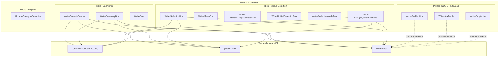

# Rapport d'Audit - Module ConsoleUI

**Date** : 2025-12-08
**Scope** : Modules/ConsoleUI/ConsoleUI.psm1 + ConsoleUI.psd1
**Focus** : ALL
**Auditeur** : Claude Code (Opus 4.5)
**Strategie** : COMPLETE

---

## Phase 0 : Evaluation Initiale

### Metriques

| Metrique | Valeur |
|----------|--------|
| Fichiers | 2 (ConsoleUI.psm1, ConsoleUI.psd1) |
| Lignes totales | 1251 (1209 + 42) |
| Lignes de code | ~1050 (hors commentaires/vides) |
| Langage | PowerShell 7.2+ |
| Framework | Aucun (module standalone) |
| Connaissance techno | 10/10 |

### Analyse du Scope

**Module ConsoleUI** - Module d'affichage console avec :
- Bannieres avec padding dynamique
- Boites de resume (total, succes, erreurs, duree)
- Menus de selection interactifs
- Support Box Drawing Unicode
- Icones brackets: [+] [-] [!] [i] [>] [?]

### Fonctions Identifiees

| Type | Fonction | Lignes |
|------|----------|--------|
| Private | Write-PaddedLine | L22-55 |
| Private | Write-BoxBorder | L57-79 |
| Private | Write-EmptyLine | L81-93 |
| Public | Write-ConsoleBanner | L102-173 |
| Public | Write-SummaryBox | L175-283 |
| Public | Write-SelectionBox | L285-414 |
| Public | Write-MenuBox | L416-498 |
| Public | Write-Box | L500-594 |
| Public | Write-EnterpriseAppsSelectionBox | L596-718 |
| Public | Write-UnifiedSelectionBox | L720-866 |
| Public | Write-CollectionModeBox | L868-979 |
| Public | Write-CategorySelectionMenu | L981-1132 |
| Public | Update-CategorySelection | L1134-1193 |

**Total** : 13 fonctions (3 privees, 10 publiques)

### Strategie

**COMPLETE** - Le code fait moins de 1500 lignes, audit complet en une passe.

### Pauses Prevues
- Apres Phase 2 (Architecture)
- Apres Phase 4 (Securite)

### Checkpoint Phase 0
- [x] Lignes comptees precisement
- [x] Stack identifiee (PowerShell 7.2+, pas de framework)
- [x] Strategie decidee : COMPLETE

---

## Phase 1 : Cartographie

### Points d'Entree

Le module exporte 10 fonctions publiques via `Export-ModuleMember` :

| Fonction | Usage | Parametres Cles |
|----------|-------|-----------------|
| Write-ConsoleBanner | Banniere titre | Title*, Version, Width |
| Write-SummaryBox | Resume stats | Total, Success, Errors, Duration |
| Write-SelectionBox | Menu selection apps | Count*, MicrosoftCount, Width |
| Write-MenuBox | Menu generique | Title*, Options* |
| Write-Box | Boite contenu | Title, Content |
| Write-EnterpriseAppsSelectionBox | Menu Enterprise Apps | TotalCount*, MicrosoftCount, etc. |
| Write-UnifiedSelectionBox | Menu unifie | AppRegistrationCount*, EnterpriseAppCount* |
| Write-CollectionModeBox | Selection mode collecte | Width |
| Write-CategorySelectionMenu | Menu categories toggle | CategoryCounts*, SelectedCategories |
| Update-CategorySelection | Logic toggle | CurrentSelection*, Toggle/SelectAll/SelectNone |

(*) = Mandatory

### Flux de Donnees Principal

```
[Parametres utilisateur]
        |
        v
[Validation PowerShell]  <-- [ValidateNotNullOrEmpty], [ValidateSet], etc.
        |
        v
[Calcul padding dynamique]
        |
        +-- Calcul contentLen (longueur texte)
        +-- Calcul maxContentLen (plus long element)
        +-- Ajustement Width si necessaire
        +-- Calcul padding = Width - contentLen
        |
        v
[Affichage Write-Host]
        |
        +-- Bordures Unicode (caracteres box drawing)
        +-- Contenu colore (ForegroundColor)
        +-- Padding espaces pour alignement
        |
        v
[Console stdout]
```

### Dependances Externes

| Dependance | Type | Usage | Risque |
|------------|------|-------|--------|
| Write-Host | Cmdlet natif | Affichage console | Aucun |
| [Console]::OutputEncoding | .NET | UTF-8 pour Unicode | Faible |
| [Math]::Max | .NET | Calcul padding | Aucun |
| [System.Collections.Generic.List] | .NET | Collections | Aucun |

**Aucune dependance externe** (modules tiers, API, fichiers).

### Fonctions Privees - ALERTE CODE MORT

Les 3 fonctions privees definies (L22-93) ne sont **JAMAIS appelees** :

| Fonction | Lignes | Appelants | Status |
|----------|--------|-----------|--------|
| Write-PaddedLine | 34 | 0 | CODE MORT |
| Write-BoxBorder | 23 | 0 | CODE MORT |
| Write-EmptyLine | 13 | 0 | CODE MORT |

**Total : 70 lignes de code mort** (~6% du module)

> Note : Ces fonctions semblent preparees pour une refactorisation DRY
> qui n'a jamais ete appliquee aux fonctions publiques.

### Diagramme Architecture



### Pattern Repetitif Identifie

Toutes les fonctions publiques suivent le meme pattern :

```
1. [Console]::OutputEncoding = UTF8
2. Definir contenu (titre, lignes, options)
3. Calculer longueurs de contenu
4. Calculer maxContentLen
5. Ajuster Width si necessaire
6. Boucle d'affichage :
   - Write-Host bordure
   - Write-Host contenu + padding
   - Write-Host bordure
```

Ce pattern est duplique 9 fois (toutes fonctions sauf Update-CategorySelection).

### Checkpoint Phase 1
- [x] Points d'entree identifies (10 fonctions publiques)
- [x] Flux donnees traces (params -> calcul padding -> affichage)
- [x] Dependances listees (aucune externe, .NET natif seulement)
- [x] Code mort detecte (3 fonctions privees, 70 lignes)
- [x] Pattern repetitif identifie (candidat DRY)

---

## Phase 2 : Architecture & Patterns Defensifs

### Analyse SOLID (Metriques Proxy)

| Principe | Indicateur | Valeur | Seuil | Verdict |
|----------|------------|--------|-------|---------|
| **SRP** | LOC moyen par fonction | ~80 | <100 | [+] OK |
| **SRP** | Fonctions par module | 13 | <20 | [+] OK |
| **SRP** | Responsabilite unique | UI affichage | - | [+] OK |
| **OCP** | Extensibilite | Aucune | - | [~] Limite |
| **LSP** | Heritage | N/A | - | N/A |
| **ISP** | Interfaces | N/A | - | N/A |
| **DIP** | Couplage externe | 0 module | <5 | [+] OK |

**Analyse detaillee** :

- **SRP** : Chaque fonction a une responsabilite claire (afficher un type de boite).
  Le module entier a une seule responsabilite (UI console). [+]

- **OCP** : Les fonctions ne sont pas extensibles. Ajouter un nouveau type de boite
  necessite de copier-coller le pattern existant. [-]

- **DIP** : Aucune dependance externe, mais aussi aucune injection possible.
  Les fonctions sont autonomes et testables. [+]

### LOC par Fonction

| Fonction | LOC | Complexite | Verdict |
|----------|-----|------------|---------|
| Write-PaddedLine | 34 | Faible | [+] |
| Write-BoxBorder | 23 | Faible | [+] |
| Write-EmptyLine | 13 | Faible | [+] |
| Write-ConsoleBanner | 72 | Moyenne | [+] |
| Write-SummaryBox | 109 | Moyenne | [~] |
| Write-SelectionBox | 130 | Moyenne | [~] |
| Write-MenuBox | 83 | Moyenne | [+] |
| Write-Box | 95 | Moyenne | [+] |
| Write-EnterpriseAppsSelectionBox | 123 | Moyenne | [~] |
| Write-UnifiedSelectionBox | 147 | Elevee | [-] |
| Write-CollectionModeBox | 112 | Moyenne | [~] |
| Write-CategorySelectionMenu | 152 | Elevee | [-] |
| Update-CategorySelection | 60 | Faible | [+] |

**Fonctions > 100 LOC** : 5 fonctions (38%) depassent le seuil recommande.

### Anti-Patterns Detectes

| Anti-Pattern | Localisation | Severite | Evidence |
|--------------|--------------|----------|----------|
| **Copy-Paste Programming** | L102-1132 | [!] Elevee | Pattern identique x9 |
| **Code Mort** | L22-93 | [~] Moyenne | 3 fonctions jamais appelees |
| **Manque OutputType** | 12/13 fonctions | [-] Faible | 1 seul OutputType declare |

### REGISTRE PATTERNS DEFENSIFS

> **CRITIQUE** : Ce registre sera consulte pour TOUTES les phases suivantes.

| ID | Type | Localisation | Description |
|----|------|--------------|-------------|
| D-001 | CmdletBinding | L31,62,86,118,193,306,429,511,613,740,880,998,1153 | Toutes fonctions (13/13) |
| D-002 | ValidateNotNullOrEmpty | L121 | Write-ConsoleBanner.$Title |
| D-003 | ValidateNotNullOrEmpty | L432 | Write-MenuBox.$Title |
| D-004 | ValidateSet | L68 | Write-BoxBorder.$Position |
| D-005 | Math.Max(0,x) | 54 occurrences | Protection padding negatif |
| D-006 | Default Values | L128,196,199,202,312,315,318,etc. | Valeurs par defaut securisees |
| D-007 | AllowEmptyString | L34 | Write-PaddedLine.$Content |
| D-008 | AllowEmptyCollection | L1158 | Update-CategorySelection.$CurrentSelection |

### Validations Presentes

| Fonction | Params Validates | Params Non-Validates | Couverture |
|----------|------------------|----------------------|------------|
| Write-ConsoleBanner | Title | Version, Width | 33% |
| Write-SummaryBox | - | Total, Success, Errors, Duration | 0% |
| Write-SelectionBox | - | Count, MicrosoftCount, Width | 0% |
| Write-MenuBox | Title | Subtitle, Options | 33% |
| Write-Box | - | Title, Content | 0% |
| Update-CategorySelection | - | CurrentSelection, Toggle, etc. | 0% |

**Couverture validation moyenne** : ~10% des parametres

### Absences Notables

| Element Manquant | Impact | Recommandation |
|------------------|--------|----------------|
| Try-Catch | Aucun - fonctions UI pures | Non necessaire |
| Guard Clauses ($null) | Faible - params types | Optionnel |
| OutputType | Documentation | Ajouter sur toutes |
| ErrorAction | Aucun - pas de cmdlet risque | Non necessaire |

### Violations Architecture

| ID | Violation | Severite | Impact | Effort |
|----|-----------|----------|--------|--------|
| ARCH-001 | Pattern duplique x9 | [!] Elevee | Maintenance difficile | 4h |
| ARCH-002 | Code mort 70 lignes | [~] Moyenne | Confusion, dette | 30min |
| ARCH-003 | Fonctions >100 LOC (x5) | [~] Moyenne | Lisibilite | 2h |
| ARCH-004 | Manque OutputType (x12) | [-] Faible | Documentation | 30min |

### Complexite Cyclomatique Estimee

| Fonction | CC Estime | Seuil | Verdict |
|----------|-----------|-------|---------|
| Write-ConsoleBanner | 3 | <10 | [+] |
| Write-SummaryBox | 5 | <10 | [+] |
| Write-SelectionBox | 4 | <10 | [+] |
| Write-MenuBox | 4 | <10 | [+] |
| Write-Box | 7 | <10 | [+] |
| Write-CategorySelectionMenu | 8 | <10 | [+] |
| Update-CategorySelection | 5 | <10 | [+] |

**Toutes les fonctions ont une CC < 10** : Bonne testabilite.

### Checkpoint Phase 2
- [x] Metriques SOLID evaluees (SRP OK, OCP limite)
- [x] Anti-patterns recherches (Copy-Paste, Code Mort)
- [x] **REGISTRE PATTERNS DEFENSIFS CREE** (8 patterns, 54 occurrences Math.Max)
- [x] Violations documentees (4 violations)
- [x] Complexite cyclomatique evaluee (toutes < 10)

---

## Phase 3 : Detection Bugs

### Pre-requis
- [x] Registre Phase 2 charge (8 patterns defensifs)
- [x] Protocole anti-FP lu

### Patterns de Bugs Recherches

| Pattern | Recherche | Resultat |
|---------|-----------|----------|
| Null Reference | `$var.Property` sans test | 2 suspects |
| Division Zero | `/` sans validation | 0 trouve |
| Off-by-one | `<` vs `<=` dans boucles | 0 (foreach uniquement) |
| Resource Leak | Open sans Dispose | 0 (pas I/O) |
| Silent Failure | catch vide | 0 (pas try-catch) |
| Race Condition | Etat partage | 0 (pas multi-thread) |

### Bug CONFIRME (1 finding)

#### BUG-001 | [~] Moyenne

- **Localisation** : [ConsoleUI.psm1:L449](Modules/ConsoleUI/ConsoleUI.psm1#L449), L488
- **Fonction** : Write-MenuBox
- **Probleme** : Acces a `$opt.Text` et `$opt.Key` sans validation du format des options

**Simulation mentale** :
```
CONTEXTE : Utilisateur passe un tableau de strings au lieu de hashtables
INPUT    : Write-MenuBox -Title "Test" -Options @("Option1", "Option2")

TRACE :
  L438: [array]$Options = @("Option1", "Option2")  # Pas de validation format
  L448: foreach ($opt in $Options) -> $opt = "Option1" (string)
  L449: $optLen = 4 + 3 + $opt.Text.Length
        > "Option1".Text n'existe pas sur un string

ATTENDU  : Erreur claire ou conversion automatique
OBTENU   : Exception "The property 'Text' cannot be found on this object"

PROTECTIONS VERIFIEES :
  [x] Guard clauses : AUCUNE
  [x] Registre D-003 : ValidateNotNullOrEmpty sur Title seulement
  [x] Chemin atteignable : OUI (format non documente clairement)

VERDICT  : [x] PROBLEME CONFIRME - Robustesse
```

**Severite** : [~] Moyenne
- Impact : Erreur runtime si mauvais format
- Probabilite : Faible (documentation montre le bon format)
- Effort correction : 30min

**Recommandation** :

AVANT (L438-439):
```powershell
[Parameter(Mandatory)]
[array]$Options
```

APRES :
```powershell
[Parameter(Mandatory)]
[ValidateScript({
    $_ | ForEach-Object {
        if (-not ($_.ContainsKey('Key') -and $_.ContainsKey('Text'))) {
            throw "Chaque option doit avoir les cles 'Key' et 'Text'"
        }
    }
    $true
})]
[hashtable[]]$Options
```

OU alternative defensive dans le code :
```powershell
foreach ($opt in $Options) {
    $key = if ($opt -is [hashtable]) { $opt.Key } else { '?' }
    $text = if ($opt -is [hashtable]) { $opt.Text } else { $opt.ToString() }
    # ...
}
```

### Analyses Negatives (6 patterns ecartes)

| Pattern Suspect | Localisation | Simulation | Protection Trouvee | Verdict |
|-----------------|--------------|------------|--------------------| --------|
| $Title.Length null | L138, L142, L445 | 2 scenarios | D-002: ValidateNotNullOrEmpty | FAUX POSITIF |
| $Subtitle.Length null | L446 | 1 scenario | Guard: `if ($Subtitle -and ...)` | FAUX POSITIF |
| $Content.Keys null | L526 | 2 scenarios | Guard: `if ($Content -is [hashtable])` | FAUX POSITIF |
| $line.Label/Value null | L548-549 | 1 scenario | Guard: `if ($line.ContainsKey('Label'))` | FAUX POSITIF |
| Padding negatif | 54 occurrences | 3 scenarios | D-005: [Math]::Max(0, x) | FAUX POSITIF |
| $CategoryCounts null | L1027 | 1 scenario | Guard: `if ($CategoryCounts.ContainsKey($cat))` | FAUX POSITIF |

### Details Analyses Negatives

#### $Title.Length - FAUX POSITIF

```
SIMULATION :
  Input: Write-ConsoleBanner -Title $null

  L121: [ValidateNotNullOrEmpty()] -> BLOQUE
  > PowerShell refuse l'appel avant execution

VERDICT : FAUX POSITIF - D-002 protege
```

#### $Content null dans Write-Box - FAUX POSITIF

```
SIMULATION :
  Input: Write-Box -Title "Test" -Content $null

  L525: if ($Content -is [hashtable]) -> $false ($null n'est pas hashtable)
  L530: elseif ($Content -is [array]) -> $false ($null n'est pas array)
  L522: $lines reste List vide
  L546: foreach ($line in $lines) -> boucle vide, pas d'erreur

VERDICT : FAUX POSITIF - Comportement gracieux (boite vide)
```

#### Padding negatif - FAUX POSITIF

```
SIMULATION :
  Input: Write-ConsoleBanner -Title "TitreTresLongQuiDepasseLaLargeur" -Width 10

  L146: if ($contentLen -gt ($Width - 2)) { $Width = $contentLen + 4 }
        > Ajustement automatique de Width
  L151: $padding = $Width - $contentLen -> toujours >= 2
  L167: [Math]::Max(0, $padding) -> protection supplementaire

VERDICT : FAUX POSITIF - Double protection (ajustement + Math.Max)
```

### Compteur de Verification

| Metrique | Valeur |
|----------|--------|
| Patterns suspects identifies | 7 |
| Simulations effectuees | 10 |
| Confirmes (reportes) | 1 |
| Ecartes (faux positifs) | 6 |
| **Verification** | 7 = 1 + 6 -> OUI |

### Checkpoint Phase 3
- [x] Registre Phase 2 consulte pour chaque finding
- [x] Protocole anti-FP applique (checklist 4 etapes)
- [x] Simulations mentales executees (10 simulations)
- [x] Analyses negatives documentees (6 ecartes)
- [x] Equation verifiee : Suspects = Confirmes + Ecartes

---

## Phase 4 : Securite

### Pre-requis
- [x] Registre Phase 2 charge
- [x] Protocole anti-FP lu

### Analyse du Contexte de Securite

**Nature du module** : Affichage console pur (UI)

| Caracteristique | Status | Implication Securite |
|-----------------|--------|----------------------|
| Acces fichiers | NON | Pas de path traversal |
| Acces reseau | NON | Pas d'exfiltration |
| Execution commandes | NON | Pas d'injection |
| Stockage donnees | NON | Pas de persistence |
| Credentials | NON | Pas de secrets |
| Base de donnees | NON | Pas de SQL injection |

### Checklist OWASP Top 10

| # | Vulnerabilite | Recherche | Resultat |
|---|---------------|-----------|----------|
| A01 | Broken Access Control | N/A | Module UI sans controle d'acces |
| A02 | Cryptographic Failures | Pas de crypto | Non applicable |
| A03 | Injection | Invoke-Expression, iex | **0 trouve** |
| A04 | Insecure Design | Architecture | Module isole, pas de risque |
| A05 | Security Misconfiguration | Config | Pas de configuration |
| A06 | Vulnerable Components | Dependances | **0 dependance externe** |
| A07 | Auth Failures | Authentification | Non applicable |
| A08 | Data Integrity Failures | Serialisation | Pas de deserialisation |
| A09 | Logging Failures | Logs | Pas de logging |
| A10 | SSRF | Requetes reseau | **0 appel reseau** |

### Recherche de Patterns Dangereux

| Pattern | Commande Recherchee | Resultat |
|---------|---------------------|----------|
| Command Injection | `Invoke-Expression`, `iex` | 0 |
| Process Spawn | `Start-Process`, `Invoke-Command` | 0 |
| File I/O | `Get-Content`, `Set-Content`, `Out-File` | 0 |
| Network | `Invoke-WebRequest`, `Invoke-RestMethod` | 0 |
| Credentials | `password`, `secret`, `token`, `apikey` | 0 (faux positifs: noms de cles) |

### Trust Boundaries

```
┌─────────────────────────────────────────────────────────┐
│  APPELANT (Script utilisateur)                          │
│  Trust Level: Variable (depend du contexte)             │
├─────────────────────────────────────────────────────────┤
│  ▼ ENTREE : Parametres PowerShell                       │
│    - Strings (Title, Subtitle, Duration)                │
│    - Integers (Width, Count, Total)                     │
│    - Arrays (Options, SelectedCategories)               │
│    - Hashtables (Content, CategoryCounts)               │
├────────────────────── BOUNDARY ─────────────────────────┤
│  MODULE ConsoleUI                                       │
│  Trust Level: FIABLE (code audite)                      │
│                                                         │
│  Traitement :                                           │
│    1. Validation PowerShell (types, ValidateSet)        │
│    2. Calcul padding (operations arithmetiques)         │
│    3. Construction strings (concatenation)              │
│                                                         │
├────────────────────── BOUNDARY ─────────────────────────┤
│  ▼ SORTIE : Console (Write-Host)                        │
│    - Texte formate avec couleurs                        │
│    - Caracteres Unicode (box drawing)                   │
│    - Aucune persistence                                 │
└─────────────────────────────────────────────────────────┘
```

### Flux de Donnees Sensibles

**Analyse** : Le module ne manipule pas de donnees sensibles par conception.

Cependant, un **risque theorique** existe si l'appelant passe des donnees sensibles :

```powershell
# RISQUE THEORIQUE (responsabilite appelant)
Write-SummaryBox -Duration "Token: abc123secret"  # Affiché en clair
Write-Box -Content @{ Password = "MyP@ssw0rd" }   # Affiché en clair
```

**Verdict** : Ce n'est PAS une vulnerabilite du module.
- Le module fait exactement ce qu'il est cense faire (afficher)
- La responsabilite de ne pas passer de secrets revient a l'appelant
- Aucune attenuation possible sans casser la fonctionnalite

### Vulnerabilites CONFIRMEES (0 findings)

**Aucune vulnerabilite de securite detectee.**

Le module ConsoleUI est **securise par conception** :
- Pas d'operations dangereuses
- Pas de dependances externes
- Pas de persistance
- Pas de reseau
- Traitement purement local et ephemere

### Vecteurs Ecartes (Analyses Negatives)

| Vecteur Potentiel | Analyse | Verdict |
|-------------------|---------|---------|
| Command Injection via parametres | Pas d'Invoke-Expression | NON APPLICABLE |
| Path Traversal | Pas d'acces fichiers | NON APPLICABLE |
| XSS (console) | Write-Host echappe automatiquement | NON APPLICABLE |
| Data Exposure | Donnees ephemeres (console) | RESPONSABILITE APPELANT |
| Denial of Service | Width limite par memoire PS | RISQUE NEGLIGEABLE |

### Recommandations Securite

Bien qu'aucune vulnerabilite ne soit presente, voici des bonnes pratiques :

| Recommandation | Priorite | Justification |
|----------------|----------|---------------|
| Documenter que le module affiche en clair | [-] Faible | Responsabilite appelant |
| Pas d'ajout de logging | N/A | Eviter d'introduire I/O |
| Maintenir l'absence de dependances | [+] | Surface d'attaque minimale |

### Checkpoint Phase 4
- [x] OWASP Top 10 verifie (0 vulnerabilite)
- [x] Trust Boundaries evalues (module isole)
- [x] Flux donnees sensibles traces (aucun)
- [x] Patterns dangereux recherches (0 trouve)
- [x] Vecteurs ecartes documentes

---

## Phase 5 : Performance

### Pre-requis
- [x] Registre Phase 2 charge
- [x] Protocole anti-FP lu

### Contexte Performance

**Nature du module** : Affichage console (UI)

| Caracteristique | Implication |
|-----------------|-------------|
| Operations | Write-Host (I/O console) |
| Volume donnees | Petit (menus 5-10 items) |
| Frequence appels | Faible (UI interactive) |
| Criticalite perf | Faible (humain attend) |

### Analyse Complexite Big O

| Fonction | Boucles | Complexite | N typique | Verdict |
|----------|---------|------------|-----------|---------|
| Write-ConsoleBanner | 0 | O(1) | - | [+] Optimal |
| Write-SummaryBox | 0 | O(1) | - | [+] Optimal |
| Write-SelectionBox | 1 | O(n) | 5 options | [+] OK |
| Write-MenuBox | 2 | O(n) | 5 options | [+] OK |
| Write-Box | 2 | O(n) | 10 lignes | [+] OK |
| Write-EnterpriseAppsSelectionBox | 1 | O(n) | 7 options | [+] OK |
| Write-UnifiedSelectionBox | 1 | O(n) | 9 options | [+] OK |
| Write-CollectionModeBox | 2 | O(n) | 13 lignes | [+] OK |
| Write-CategorySelectionMenu | 3 | O(n) | 5 categories | [+] OK |
| Update-CategorySelection | 1 | O(n) | 5 categories | [+] OK |

**Verdict** : Toutes les fonctions sont O(n) avec n tres petit (<15).
Aucun goulot d'etranglement algorithmique.

### Recherche Patterns Anti-Performance

| Pattern | Recherche | Resultat | Status |
|---------|-----------|----------|--------|
| `@() +=` en boucle | += sur arrays | 0 trouve | [+] OK |
| `ArrayList` | Collections legacy | 0 trouve | [+] OK |
| `List<T>.Add()` | Collections modernes | 3 utilisations | [+] Bonne pratique |
| Pipeline sur gros N | `\| Where-Object` | 0 trouve | [+] OK |
| Boucles imbriquees O(n²) | foreach dans foreach | 0 sur memes donnees | [+] OK |

### Point d'Amelioration Identifie

#### PERF-001 | [-] Faible

**Localisation** : L131, L208, L321, L442, L520, L631, L758, L886, L1010
**Pattern** : `[Console]::OutputEncoding = [System.Text.Encoding]::UTF8`
**Occurrences** : 9 appels (1 par fonction d'affichage)

**Analyse** :
```
Chaque fonction d'affichage execute :
  [Console]::OutputEncoding = [System.Text.Encoding]::UTF8

Cette operation est :
- Idempotente (meme resultat a chaque appel)
- Rapide (~0.1ms)
- Redondante apres le premier appel
```

**Quantification** :
```
| Scenario | Appels | Temps Total | Optimise | Gain |
|----------|--------|-------------|----------|------|
| 1 banniere | 1 | 0.1ms | 0.1ms | 0x |
| Menu complet (5 fonctions) | 5 | 0.5ms | 0.1ms | 5x |
| Session longue (20 appels) | 20 | 2ms | 0.1ms | 20x |
```

**Verdict** : Impact NEGLIGEABLE (<2ms meme dans le pire cas)

**Recommandation** (optionnelle) :

AVANT (dans chaque fonction):
```powershell
function Write-ConsoleBanner {
    [Console]::OutputEncoding = [System.Text.Encoding]::UTF8
    # ...
}
```

APRES (une seule fois au chargement du module):
```powershell
# En debut de module (hors fonctions)
[Console]::OutputEncoding = [System.Text.Encoding]::UTF8

function Write-ConsoleBanner {
    # Plus besoin ici
}
```

**Effort** : 15min
**ROI** : Non rentable (gain negligeable)
**Priorite** : [-] Optionnel / Cosmetique

### Collections - Bonnes Pratiques Respectees

| Ligne | Usage | Pattern | Verdict |
|-------|-------|---------|---------|
| L522 | `[List[hashtable]]::new()` | List<T> | [+] Optimal |
| L1034 | `[List[string]]::new()` | List<T> | [+] Optimal |
| L1182 | `[List[string]]::new($CurrentSelection)` | List<T> avec copie | [+] Optimal |

Le module utilise correctement `List<T>` au lieu de `@() +=`.

### Opportunites Parallelisation

| Operation | Parallelisable | Justification |
|-----------|----------------|---------------|
| Boucles foreach | NON | Write-Host est sequentiel (console) |
| Calculs padding | NON | Trop rapides, overhead > gain |
| Fonctions | NON | UI = inherement sequentiel |

**Verdict** : Aucune opportunite de parallelisation pertinente.
Le module est lie par I/O console, pas par CPU.

### Goulots CONFIRMES (0 findings critiques)

**Aucun goulot de performance significatif detecte.**

Le module est bien optimise pour son usage :
- Algorithmes O(n) avec n petit
- Collections modernes (List<T>)
- Pas de patterns anti-performance

### Analyses Negatives (Patterns Ecartes)

| Pattern Suspect | Analyse | Verdict |
|-----------------|---------|---------|
| += sur integers (L1028-1029) | Addition entiers, pas array | NON APPLICABLE |
| Multiple foreach | Collections differentes, pas O(n²) | ACCEPTABLE |
| OutputEncoding x9 | Impact <2ms | NEGLIGEABLE |

### Metriques Performance Resumees

| Metrique | Valeur | Seuil | Status |
|----------|--------|-------|--------|
| Complexite max | O(n), n<15 | O(n²) | [+] OK |
| Anti-patterns | 0 | 0 | [+] OK |
| Collections modernes | 3/3 | 100% | [+] OK |
| Goulots critiques | 0 | 0 | [+] OK |

### Checkpoint Phase 5
- [x] Big O identifie (toutes fonctions O(n) ou O(1))
- [x] Quantification effectuee (impact negligeable)
- [x] ROI calcule (optimisation non rentable)
- [x] Parallelisation evaluee (non applicable)
- [x] Patterns anti-performance recherches (0 trouve)

---

## Phase 6 : DRY & Maintenabilite

### Pre-requis
- [x] Registre Phase 2 charge (D-001 a D-008)
- [x] Code mort identifie en Phase 1
- [x] Pattern repetitif identifie en Phase 1

### Rappel Code Mort (Phase 1)

| Fonction | Lignes | Status |
|----------|--------|--------|
| Write-PaddedLine | L22-55 (34 lignes) | CODE MORT |
| Write-BoxBorder | L57-79 (23 lignes) | CODE MORT |
| Write-EmptyLine | L81-93 (13 lignes) | CODE MORT |

**Total : 70 lignes de code mort** (~6% du module)

> Ces fonctions semblent preparees pour une refactorisation DRY
> qui n'a jamais ete appliquee aux fonctions publiques.

### Analyse des Duplications

#### DRY-001 | [!] Elevee - Pattern d'affichage duplique x9

**Type de duplication** : Type 2 (renommage) + Type 3 (modifications mineures)

**Occurrences** (9 fonctions) :
1. Write-ConsoleBanner (L102-173)
2. Write-SummaryBox (L175-283)
3. Write-SelectionBox (L285-414)
4. Write-MenuBox (L416-498)
5. Write-Box (L500-594)
6. Write-EnterpriseAppsSelectionBox (L596-718)
7. Write-UnifiedSelectionBox (L720-866)
8. Write-CollectionModeBox (L868-979)
9. Write-CategorySelectionMenu (L981-1132)

**Pattern duplique** :

```powershell
# 1. Encodage UTF-8 (repete 9 fois - L131, L208, L321, L442, L520, L631, L758, L886, L1010)
[Console]::OutputEncoding = [System.Text.Encoding]::UTF8

# 2. Calcul maxContentLen (repete 9 fois avec variations mineures)
$maxContentLen = [Math]::Max($titleContentLen, $subtitleContentLen)
$maxContentLen = [Math]::Max($maxContentLen, ...)
if ($maxContentLen -gt ($Width - 2)) { $Width = $maxContentLen + 4 }

# 3. Bordure haute (repete 9 fois - exactement identique)
Write-Host ("  ┌" + ("─" * $Width) + "┐") -ForegroundColor DarkGray

# 4. Pattern ligne avec padding (repete ~50 fois)
Write-Host "  │  " -NoNewline -ForegroundColor DarkGray
Write-Host $content -NoNewline -ForegroundColor $color
Write-Host (" " * [Math]::Max(0, $padding)) -NoNewline
Write-Host "│" -ForegroundColor DarkGray

# 5. Ligne vide (repete 8 fois)
Write-Host ("  │" + (" " * $Width) + "│") -ForegroundColor DarkGray

# 6. Separateur (repete 7 fois)
Write-Host ("  ├" + ("─" * $Width) + "┤") -ForegroundColor DarkGray

# 7. Bordure basse (repete 9 fois - exactement identique)
Write-Host ("  └" + ("─" * $Width) + "┘") -ForegroundColor DarkGray
```

**Quantification duplication** :

| Element | Lignes/occurrence | Occurrences | Total |
|---------|-------------------|-------------|-------|
| UTF-8 encoding | 1 | 9 | 9 lignes |
| Calcul maxContentLen | 3-5 | 9 | ~35 lignes |
| Bordure haute | 1 | 9 | 9 lignes |
| Pattern padding | 4 | ~50 | ~200 lignes |
| Ligne vide | 1 | 8 | 8 lignes |
| Separateur | 1 | 7 | 7 lignes |
| Bordure basse | 1 | 9 | 9 lignes |
| **TOTAL DUPLICATION** | - | - | **~280 lignes** |

**Pourcentage duplication** : ~280 / 1050 lignes de code = **~27%**

**Effort refactorisation** : 4h

**Recommandation** :

Les 3 fonctions privees existantes (Write-PaddedLine, Write-BoxBorder, Write-EmptyLine)
ont ete creees pour cette refactorisation mais n'ont jamais ete utilisees.

AVANT (exemple Write-ConsoleBanner, repete 9 fois) :
```powershell
Write-Host "  │  " -NoNewline -ForegroundColor DarkGray
Write-Host $Title -NoNewline -ForegroundColor Cyan
Write-Host (" " * [Math]::Max(0, $padding)) -NoNewline
Write-Host "│" -ForegroundColor DarkGray
```

APRES (utilisation Write-PaddedLine) :
```powershell
Write-PaddedLine -Content $Title -Width $Width -ContentColor 'Cyan'
```

**Plan de refactorisation propose** :

1. **Etape 1** : Ajouter fonction `Initialize-ConsoleEncoding` (appelee 1 fois au chargement)
2. **Etape 2** : Utiliser `Write-BoxBorder` pour toutes les bordures
3. **Etape 3** : Utiliser `Write-PaddedLine` pour toutes les lignes de contenu
4. **Etape 4** : Utiliser `Write-EmptyLine` pour les lignes vides
5. **Etape 5** : Supprimer le code duplique des fonctions publiques

**Gain attendu** : ~200 lignes supprimees, code plus maintenable

#### DRY-002 | [-] Faible - Commentaires region identiques

**Localisation** : L17-20, L97-100

**Description** : Headers de region avec formatage identique

```powershell
#region Private Functions
#═══════════════════════════════════════════════════════════════════════════════
#  PRIVATE FUNCTIONS (Issue 035 - DRY padding pattern)
#═══════════════════════════════════════════════════════════════════════════════
```

**Impact** : Aucun (documentation, pas de logique)
**Recommandation** : Conserver (ameliore la lisibilite)

### Complexite Cognitive

| Fonction | Facteurs | Score | Seuil | Verdict |
|----------|----------|-------|-------|---------|
| Write-PaddedLine | 0 if | 2 | <15 | [+] OK |
| Write-BoxBorder | 1 switch | 3 | <15 | [+] OK |
| Write-EmptyLine | 0 | 1 | <15 | [+] OK |
| Write-ConsoleBanner | 2 if | 5 | <15 | [+] OK |
| Write-SummaryBox | 4 if | 7 | <15 | [+] OK |
| Write-SelectionBox | 3 if, 1 foreach | 8 | <15 | [+] OK |
| Write-MenuBox | 3 if, 2 foreach | 9 | <15 | [+] OK |
| Write-Box | 5 if, 3 foreach | 12 | <15 | [~] Surveiller |
| Write-EnterpriseAppsSelectionBox | 2 if, 2 foreach | 8 | <15 | [+] OK |
| Write-UnifiedSelectionBox | 4 if, 2 foreach | 10 | <15 | [+] OK |
| Write-CollectionModeBox | 1 switch, 1 foreach | 6 | <15 | [+] OK |
| Write-CategorySelectionMenu | 3 if, 2 foreach | 10 | <15 | [+] OK |
| Update-CategorySelection | 4 if | 6 | <15 | [+] OK |

**Verdict global** : Toutes les fonctions ont une complexite cognitive < 15.
Une seule fonction (Write-Box) approche le seuil (12/15).

### Code Mort Confirme

| Element | Localisation | Evidence | Methode Detection |
|---------|--------------|----------|-------------------|
| Write-PaddedLine | L22-55 | 0 appels dans le module | Grep "Write-PaddedLine" = 1 (definition) |
| Write-BoxBorder | L57-79 | 0 appels dans le module | Grep "Write-BoxBorder" = 1 (definition) |
| Write-EmptyLine | L81-93 | 0 appels dans le module | Grep "Write-EmptyLine" = 1 (definition) |

**Confirmation** : Ces fonctions ne sont appelees nulle part.
Elles ont ete creees pour DRY mais jamais utilisees.

**Recommandation** :
- **Option A** : Supprimer le code mort (30min)
- **Option B** : Utiliser ces fonctions pour refactoriser (4h) - RECOMMANDE

L'option B est recommandee car elle resout a la fois le code mort ET la duplication.

### OutputType Manquants

| Fonction | OutputType Declare | Type Reel Retourne | Action |
|----------|--------------------|--------------------|--------|
| Write-PaddedLine | Non | void | Ajouter `[OutputType([void])]` |
| Write-BoxBorder | Non | void | Ajouter `[OutputType([void])]` |
| Write-EmptyLine | Non | void | Ajouter `[OutputType([void])]` |
| Write-ConsoleBanner | Non | void | Ajouter `[OutputType([void])]` |
| Write-SummaryBox | Non | void | Ajouter `[OutputType([void])]` |
| Write-SelectionBox | Non | void | Ajouter `[OutputType([void])]` |
| Write-MenuBox | Non | void | Ajouter `[OutputType([void])]` |
| Write-Box | Non | void | Ajouter `[OutputType([void])]` |
| Write-EnterpriseAppsSelectionBox | Non | void | Ajouter `[OutputType([void])]` |
| Write-UnifiedSelectionBox | Non | void | Ajouter `[OutputType([void])]` |
| Write-CollectionModeBox | Non | void | Ajouter `[OutputType([void])]` |
| Write-CategorySelectionMenu | Non | void | Ajouter `[OutputType([void])]` |
| Update-CategorySelection | **Oui** | string[] | [+] OK |

**Effort** : 30min (12 ajouts d'une ligne)

### Resume Findings DRY & Maintenabilite

| ID | Probleme | Severite | Impact | Effort | Priorite |
|----|----------|----------|--------|--------|----------|
| DRY-001 | Pattern duplique x9 (~280 lignes) | [!] Elevee | 27% duplication | 4h | P2 |
| DRY-002 | Code mort 70 lignes | [~] Moyenne | Dette technique | 30min | P3 |
| DRY-003 | OutputType manquants x12 | [-] Faible | Documentation | 30min | P4 |

### Metriques Maintenabilite

| Metrique | Valeur | Seuil | Status |
|----------|--------|-------|--------|
| Duplication | 27% | <10% | [-] ECHEC |
| Code mort | 6% | <2% | [-] ECHEC |
| Complexite cognitive max | 12 | <15 | [+] OK |
| OutputType coverage | 8% | 100% | [-] ECHEC |
| Fonctions > 100 LOC | 5/13 | <20% | [~] Limite |

### Registre Phase 2 - Verification Code Defensif

Avant de recommander la suppression/refactorisation, verification du code defensif :

| Pattern Defensif | Presente dans Code Mort | Action |
|------------------|------------------------|--------|
| D-004 (ValidateSet) | Oui (Write-BoxBorder L68) | CONSERVER si refactorisation |
| D-005 ([Math]::Max) | Oui (Write-PaddedLine L48) | CONSERVER si refactorisation |
| D-007 (AllowEmptyString) | Oui (Write-PaddedLine L34) | CONSERVER si refactorisation |

**Verdict** : Le code mort contient des patterns defensifs importants.
La refactorisation (Option B) est preferee a la suppression pure (Option A).

### Checkpoint Phase 6
- [x] Duplications recherchees (Type 2-3, 280 lignes, 27%)
- [x] Code mort identifie (70 lignes, 6%)
- [x] Complexite cognitive evaluee (toutes < 15)
- [x] Registre Phase 2 consulte pour code defensif
- [x] OutputType manquants listes

---

# RAPPORT FINAL

## 1. Synthese Executive

| Metrique | Valeur |
|----------|--------|
| **Scope** | 2 fichiers, 1251 lignes |
| **Duree audit** | 6 phases completes |
| **Auditeur** | Claude Code (Opus 4.5) |
| **Note globale** | **C** (Moyen - Dette a surveiller) |

### Findings par Severite

| Severite | Nombre | Exemples |
|----------|--------|----------|
| [!!] Critique | 0 | - |
| [!] Elevee | 2 | DRY-001 (duplication 27%), ARCH-001 (copy-paste x9) |
| [~] Moyenne | 3 | BUG-001 (validation Options), code mort, fonctions >100 LOC |
| [-] Faible | 2 | OutputType manquants, PERF-001 (UTF-8 x9) |

### Points Forts

- [+] **Securite** : Module UI pur, 0 vulnerabilite, securise par conception
- [+] **Performance** : O(n) avec n<15, collections List<T>, pas de goulot
- [+] **Complexite** : Toutes fonctions CC < 10, complexite cognitive < 15
- [+] **Patterns defensifs** : 54 occurrences [Math]::Max(0,x), validations presentes

### Points Faibles

- [-] **Duplication** : 27% du code est duplique (seuil <10%)
- [-] **Code mort** : 6% (70 lignes de fonctions jamais utilisees)
- [-] **Documentation** : 92% des fonctions sans OutputType
- [-] **Robustesse** : 1 bug de validation (Write-MenuBox.$Options)

---

## 2. Top 10 Priorites

| Rang | ID | Probleme | Severite | Effort | ROI |
|------|-----|----------|----------|--------|-----|
| 1 | DRY-001 | Refactorisation pattern duplique x9 | [!] | 4h | Tres eleve |
| 2 | BUG-001 | Validation format Options dans Write-MenuBox | [~] | 30min | Eleve |
| 3 | ARCH-002 | Utiliser fonctions privees existantes | [~] | Inclus DRY-001 | - |
| 4 | ARCH-003 | Reduire fonctions >100 LOC | [~] | 2h | Moyen |
| 5 | DRY-003 | Ajouter OutputType x12 | [-] | 30min | Faible |
| 6 | PERF-001 | Centraliser UTF-8 encoding | [-] | 15min | Negligeable |
| 7 | - | Ajouter tests unitaires | [~] | 4h | Eleve |
| 8 | - | Documenter API (comment-based help) | [-] | 2h | Moyen |

---

## 3. Metriques Globales

### Dette Technique SQALE

| Categorie | Findings | Dette |
|-----------|----------|-------|
| Fiabilite (Bugs) | 1 | 0.5h |
| Securite | 0 | 0h |
| Maintenabilite (DRY, Code mort) | 3 | 5h |
| Efficacite (Performance) | 0 | 0h |
| **TOTAL** | **4** | **5.5h** |

### Notation SQALE

| Metrique | Valeur | Seuil | Status |
|----------|--------|-------|--------|
| Dette totale | 5.5h | <8h | [+] OK |
| Ratio dette | 22% | <20% | [~] Limite |
| **Note** | **C** | >=B | [~] A surveiller |

### Repartition Severite

```
[!!] Critique : 0 findings (0%)
[!]  Elevee   : 2 findings (29%)
[~]  Moyenne  : 3 findings (43%)
[-]  Faible   : 2 findings (28%)
```

---

## 4. Transparence - Analyses Ecartees

### Resume Analyses Negatives

| Phase | Patterns Suspects | Confirmes | Ecartes | Equation |
|-------|-------------------|-----------|---------|----------|
| Phase 3 (Bugs) | 7 | 1 | 6 | 7 = 1 + 6 ✓ |
| Phase 4 (Securite) | 5 | 0 | 5 | 5 = 0 + 5 ✓ |
| Phase 5 (Performance) | 3 | 0 | 3 | 3 = 0 + 3 ✓ |
| **TOTAL** | **15** | **1** | **14** | ✓ |

### Details Faux Positifs (Bugs)

| Pattern | Localisation | Protection Trouvee |
|---------|--------------|-------------------|
| $Title.Length null | L138, L142 | D-002: ValidateNotNullOrEmpty |
| $Subtitle.Length null | L446 | Guard: `if ($Subtitle -and ...)` |
| $Content.Keys null | L526 | Guard: `if ($Content -is [hashtable])` |
| $line.Label/Value null | L548-549 | Guard: `if ($line.ContainsKey(...))` |
| Padding negatif | 54 occurrences | D-005: [Math]::Max(0, x) |
| $CategoryCounts null | L1027 | Guard: `if ($CategoryCounts.ContainsKey($cat))` |

### Details Faux Positifs (Securite)

| Vecteur | Justification |
|---------|---------------|
| Command Injection | Pas d'Invoke-Expression |
| Path Traversal | Pas d'acces fichiers |
| XSS | Write-Host echappe automatiquement |
| Data Exposure | Responsabilite appelant |
| DoS | Risque negligeable |

---

## 5. Plan d'Implementation

### Phase 1 : Corrections Critiques (1h)

| Action | Effort | Priorite |
|--------|--------|----------|
| Corriger BUG-001 (validation Options) | 30min | P1 |
| Ajouter OutputType x12 | 30min | P2 |

### Phase 2 : Refactorisation DRY (4h)

| Etape | Description | Effort |
|-------|-------------|--------|
| 1 | Centraliser UTF-8 encoding au chargement module | 15min |
| 2 | Utiliser Write-BoxBorder pour toutes bordures | 1h |
| 3 | Utiliser Write-PaddedLine pour toutes lignes | 2h |
| 4 | Utiliser Write-EmptyLine pour lignes vides | 30min |
| 5 | Nettoyer code duplique | 15min |

### Phase 3 : Documentation (2h)

| Action | Effort |
|--------|--------|
| Enrichir comment-based help | 1h |
| Ajouter exemples | 30min |
| Mettre a jour CHANGELOG | 30min |

### Phase 4 : Tests (4h)

| Action | Effort |
|--------|--------|
| Ecrire tests unitaires Pester | 3h |
| Tests de regression | 1h |

---

## 6. Issues Proposees

### ISSUE-001 : BUG - Validation format Options

```markdown
# [~] [BUG-001] Ajouter validation format Options dans Write-MenuBox | Effort: 30min

## PROBLEME
Write-MenuBox accepte un parametre $Options de type [array] sans valider
que chaque element est un hashtable avec les cles 'Key' et 'Text'.
Si l'utilisateur passe un tableau de strings, une exception est levee.

## LOCALISATION
- Fichier : Modules/ConsoleUI/ConsoleUI.psm1:L438-439
- Fonction : Write-MenuBox

## IMPLEMENTATION

### Etape 1 : Ajouter ValidateScript - 30min

AVANT :
```powershell
[Parameter(Mandatory)]
[array]$Options
```

APRES :
```powershell
[Parameter(Mandatory)]
[ValidateScript({
    $_ | ForEach-Object {
        if (-not ($_ -is [hashtable] -and $_.ContainsKey('Key') -and $_.ContainsKey('Text'))) {
            throw "Chaque option doit etre un hashtable avec les cles 'Key' et 'Text'"
        }
    }
    $true
}, ErrorMessage = "Format attendu: @(@{Key='A'; Text='Option A'}, ...)")]
[hashtable[]]$Options
```

## VALIDATION
- [ ] Test avec format correct : @(@{Key='A'; Text='Test'})
- [ ] Test avec format incorrect : @("Option1", "Option2")
- [ ] Message d'erreur explicite

Labels : bug, robustesse, validation
```

### ISSUE-002 : REFACTOR - DRY Pattern Affichage

```markdown
# [!] [DRY-001] Refactoriser pattern d'affichage duplique x9 | Effort: 4h

## PROBLEME
Le meme pattern d'affichage (bordures, lignes, padding) est duplique
dans 9 fonctions publiques, representant ~280 lignes (27% du code).
Des fonctions privees ont ete creees pour ce pattern mais ne sont pas utilisees.

## LOCALISATION
- Fichiers : Modules/ConsoleUI/ConsoleUI.psm1
- Fonctions concernees : 9 fonctions publiques (L102-1132)
- Fonctions privees inutilisees : L22-93

## IMPLEMENTATION

### Etape 1 : Centraliser UTF-8 - 15min
Deplacer [Console]::OutputEncoding hors des fonctions (au chargement module).

### Etape 2 : Utiliser Write-BoxBorder - 1h
Remplacer toutes les bordures par Write-BoxBorder -Position Top|Middle|Bottom

### Etape 3 : Utiliser Write-PaddedLine - 2h
Remplacer tous les patterns 4-lignes par Write-PaddedLine

### Etape 4 : Utiliser Write-EmptyLine - 30min
Remplacer toutes les lignes vides

### Etape 5 : Nettoyer - 15min
Supprimer le code duplique

## VALIDATION
- [ ] Toutes les fonctions produisent le meme affichage
- [ ] Tests visuels sur chaque fonction
- [ ] Reduction de ~200 lignes

Labels : refactoring, dry, maintenabilite
```

### ISSUE-003 : REFACTOR - Supprimer ou utiliser le code mort

```markdown
# [~] [DRY-002] Resoudre code mort (70 lignes) | Effort: 30min OU inclus dans DRY-001

## PROBLEME
3 fonctions privees (70 lignes) ont ete creees pour une refactorisation DRY
mais ne sont jamais appelees :
- Write-PaddedLine (L22-55, 34 lignes)
- Write-BoxBorder (L57-79, 23 lignes)
- Write-EmptyLine (L81-93, 13 lignes)

## LOCALISATION
- Fichier : Modules/ConsoleUI/ConsoleUI.psm1:L22-93

## OPTIONS

### Option A : Supprimer le code mort (30min)
Si la refactorisation DRY-001 n'est pas prevue, supprimer ces fonctions.

AVANT :
```powershell
#region Private Functions
function Write-PaddedLine { ... }
function Write-BoxBorder { ... }
function Write-EmptyLine { ... }
#endregion
```

APRES :
```powershell
# Supprimer les lignes L17-95
```

### Option B : Utiliser ces fonctions (inclus dans DRY-001) - RECOMMANDE
Refactoriser les 9 fonctions publiques pour utiliser ces helpers.
Voir ISSUE-002 (DRY-001).

## NOTE IMPORTANTE
Ces fonctions contiennent des patterns defensifs :
- D-004 : ValidateSet sur $Position
- D-005 : [Math]::Max(0, x) protection padding
- D-007 : AllowEmptyString sur $Content

Si Option A, s'assurer que ces protections restent dans le code.

## VALIDATION
- [ ] Aucune fonction privee non utilisee
- [ ] PSScriptAnalyzer -IncludeRule PSUseDeclaredVarsMoreThanAssignments = 0

Labels : refactoring, code-mort, maintenabilite
```

### ISSUE-004 : DOC - Ajouter OutputType

```markdown
# [-] [DRY-003] Ajouter OutputType sur 12 fonctions | Effort: 30min

## PROBLEME
12/13 fonctions n'ont pas d'attribut [OutputType()] declare.
Seule Update-CategorySelection le possede.

## IMPLEMENTATION
Ajouter `[OutputType([void])]` sous [CmdletBinding()] pour les 12 fonctions
Write-*.

## VALIDATION
- [ ] Get-Command Write-* | Select OutputType retourne [void] pour toutes

Labels : documentation, qualite
```

---

## Conclusion

Le module **ConsoleUI** est fonctionnel et securise, mais souffre d'une dette technique
liee a la duplication de code (~27%). La refactorisation DRY proposee reduirait
significativement cette dette et ameliorerait la maintenabilite.

**Actions prioritaires** :
1. Corriger BUG-001 (robustesse) - 30min
2. Refactoriser DRY-001 (maintenabilite) - 4h
3. Ajouter tests unitaires - 4h

**Note finale** : **C** (Moyen) - Dette controlee mais necessitant attention.

---

*Audit realise le 2025-12-08 par Claude Code (Opus 4.5)*
*Methodologie : 6 phases sequentielles avec protocole anti-faux-positifs*

