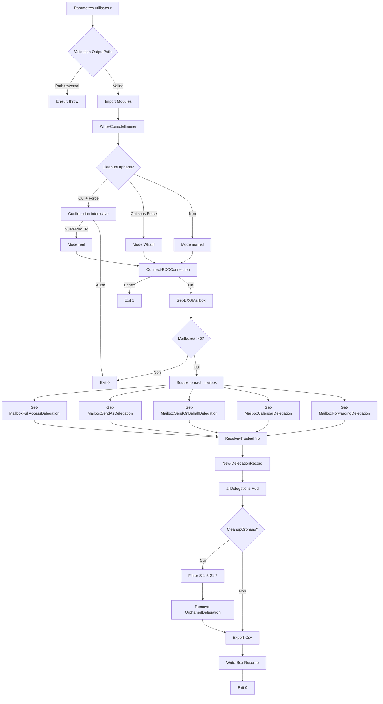

# Rapport d'Audit - Get-ExchangeDelegation

**Date** : 2025-12-15
**Scope** : Projet complet (script principal + modules)
**Focus** : ALL
**Auditeur** : Claude Code (Opus 4.5)
**Strategie** : COMPLETE

---

## Phase 0 : Evaluation Initiale

### Inventaire des Fichiers

| Fichier | Lignes | Role |
|---------|--------|------|
| Get-ExchangeDelegation.ps1 | 781 | Script principal - collecte delegations Exchange |
| Modules/Write-Log/Write-Log.psm1 | 328 | Module logging ISO 8601 |
| Modules/ConsoleUI/ConsoleUI.psm1 | 1244 | Module UI console (boites, menus) |
| Modules/EXOConnection/EXOConnection.psm1 | 368 | Module connexion Exchange Online |
| **TOTAL** | **2721** | |

### Metriques Globales

| Metrique | Valeur |
|----------|--------|
| Fichiers | 4 |
| Lignes totales | 2721 |
| Lignes de code (estim.) | ~2200 (hors commentaires/vides) |
| Langage | PowerShell 7.2+ |
| Framework | ExchangeOnlineManagement |
| Connaissance techno | 9/10 |

### Stack Technologique

- **Runtime** : PowerShell 7.2+
- **Modules externes** : ExchangeOnlineManagement
- **Modules internes** : Write-Log, ConsoleUI, EXOConnection
- **Standards appliques** : RFC 5424 (syslog), ISO 8601 (timestamps)
- **Cible** : Exchange Online / Microsoft 365

### Evaluation Connaissance

| Concept | Connaissance | Critique pour audit ? |
|---------|--------------|----------------------|
| PowerShell 7.2+ | 9/10 | Oui |
| Exchange Online cmdlets | 9/10 | Oui |
| Gestion delegations Exchange | 9/10 | Oui |
| Module ExchangeOnlineManagement | 9/10 | Oui |
| Securite PowerShell | 9/10 | Oui |

**Verdict** : Connaissance suffisante (>= 9/10) - Pas de recherche prealable necessaire.

### Strategie d'Audit

**Decision** : COMPLETE (2721 lignes < 5000 lignes)

**Justification** :
- Le code tient dans le contexte
- Architecture modulaire claire
- 4 fichiers bien delimites
- Pas de decoupe necessaire

### Checkpoint Phase 0
- [x] Lignes comptees precisement
- [x] Stack identifiee
- [x] Strategie decidee et justifiee

---

## Phase 1 : Cartographie

### Points d'Entree

| Fichier | Fonction/Point | Description |
|---------|----------------|-------------|
| Get-ExchangeDelegation.ps1 | Script principal (L567-780) | Point d'entree unique via parametre CmdletBinding |
| Get-ExchangeDelegation.ps1 | param() L56-72 | 5 parametres : OutputPath, IncludeSharedMailbox, IncludeRoomMailbox, CleanupOrphans, Force |

### Flux de Donnees Principal

```
[Parametres utilisateur]
    │
    ├─ $OutputPath (optionnel)
    ├─ $IncludeSharedMailbox (switch, defaut: $true)
    ├─ $IncludeRoomMailbox (switch, defaut: $false)
    ├─ $CleanupOrphans (switch)
    └─ $Force (switch)
    │
    v
[Validation Entrees] (L84-98)
    │
    ├─ GetFullPath() + Test path traversal
    ├─ Creation dossier Output si inexistant
    │
    v
[Import Modules] (L100-104)
    │
    ├─ Write-Log.psm1
    ├─ ConsoleUI.psm1
    └─ EXOConnection.psm1
    │
    v
[Connexion Exchange Online] (L607-616)
    │
    └─ Connect-EXOConnection -> Test-EXOConnection
    │
    v
[Recuperation Mailboxes] (L618-637)
    │
    └─ Get-EXOMailbox -ResultSize Unlimited
    │
    v
[Collecte Delegations] (L639-687)
    │
    ├─ Get-MailboxFullAccessDelegation
    ├─ Get-MailboxSendAsDelegation
    ├─ Get-MailboxSendOnBehalfDelegation
    ├─ Get-MailboxCalendarDelegation
    └─ Get-MailboxForwardingDelegation
    │
    v
[Nettoyage Orphelins] (L708-745) - Si -CleanupOrphans
    │
    └─ Remove-OrphanedDelegation (avec -WhatIf par defaut)
    │
    v
[Export CSV] (L693-706)
    │
    └─ Export-Csv UTF8
    │
    v
[Resume & Logs]
```

### Diagramme Mermaid



### Dependances Externes

| Module | Usage | Risque |
|--------|-------|--------|
| ExchangeOnlineManagement | Get-EXOMailbox, Get-MailboxPermission, Get-RecipientPermission, Get-MailboxFolderStatistics, Get-MailboxFolderPermission, Get-Recipient, Remove-MailboxPermission, Remove-RecipientPermission, Set-Mailbox | Moyen - API Microsoft |
| System.IO.Path | GetFullPath() | Faible - .NET Core |
| System.Collections.Generic | List<T> | Faible - .NET Core |

### Dependances Internes (Modules)

| Module | Fonctions Exportees | Utilisation |
|--------|---------------------|-------------|
| Write-Log | Write-Log, Initialize-Log, Invoke-LogRotation | Logging centralise |
| ConsoleUI | Write-ConsoleBanner, Write-Box | Affichage UI |
| EXOConnection | Connect-EXOConnection, Test-EXOConnection, Get-EXOConnectionInfo, Disconnect-EXOConnection | Gestion connexion |

### Fonctions du Script Principal

| Fonction | Lignes | Role | Appels |
|----------|--------|------|--------|
| Write-Status | 144-164 | Affichage status colore | Interne |
| Test-IsSystemAccount | 172-190 | Filtre comptes systeme | Get-Mailbox*Delegation |
| Resolve-TrusteeInfo | 192-241 | Resolution trustee robuste | Get-Mailbox*Delegation |
| Remove-OrphanedDelegation | 243-312 | Suppression delegations orphelines | Boucle cleanup |
| New-DelegationRecord | 314-339 | Factory objet delegation | Get-Mailbox*Delegation |
| Get-MailboxFullAccessDelegation | 341-377 | Collecte FullAccess | Boucle principale |
| Get-MailboxSendAsDelegation | 379-414 | Collecte SendAs | Boucle principale |
| Get-MailboxSendOnBehalfDelegation | 416-451 | Collecte SendOnBehalf | Boucle principale |
| Get-MailboxCalendarDelegation | 453-512 | Collecte Calendar | Boucle principale |
| Get-MailboxForwardingDelegation | 514-561 | Collecte Forwarding | Boucle principale |

### Checkpoint Phase 1
- [x] Points d'entree identifies
- [x] Flux donnees traces
- [x] Dependances listees
- [x] Diagramme Mermaid genere

---

## Phase 2 : Architecture & Patterns Defensifs

### Analyse SOLID (Metriques Proxy)

| Principe | Indicateur | Valeur | Seuil | Verdict |
|----------|------------|--------|-------|---------|
| **SRP** | LOC par fonction (max) | 60 (Get-MailboxCalendarDelegation) | <100 | [+] Bon |
| **SRP** | Fonctions par fichier principal | 10 | <15 | [+] Bon |
| **SRP** | Parametres par fonction (max) | 7 (New-DelegationRecord) | <8 | [+] Acceptable |
| **OCP** | Switch geants | 2 (Write-Status, Remove-OrphanedDelegation) | <5 | [+] Bon |
| **DIP** | Modules importes vs hardcoded | 3 modules injectes | - | [+] Bon |
| **DIP** | Couplage Exchange cmdlets | Direct (non injectable) | - | [~] Acceptable |

### Anti-Patterns Recherches

| Pattern | Recherche | Resultat | Verdict |
|---------|-----------|----------|---------|
| God Object | Fichier >500 LOC avec >15 methodes | Script principal: 781 LOC, 10 fonctions | [+] Non detecte |
| Spaghetti Code | Cycles dependances, goto | Aucun | [+] Non detecte |
| Big Ball of Mud | Organisation chaotique | Architecture claire en regions | [+] Non detecte |
| Lava Flow | Code mort, TODO anciens | Aucun TODO | [+] Non detecte |
| Copy-Paste Programming | Blocs dupliques >20 lignes | Get-Mailbox*Delegation (pattern similaire mais justifie) | [~] A verifier Phase 6 |

### REGISTRE PATTERNS DEFENSIFS (CRITIQUE)

Ce registre sera consulte par TOUTES les phases suivantes.

#### Script Principal (Get-ExchangeDelegation.ps1)

| ID | Type | Localisation | Description | Protege contre |
|----|------|--------------|-------------|----------------|
| D-001 | ErrorAction Stop | L76 | `$ErrorActionPreference = 'Stop'` global | Erreurs silencieuses |
| D-002 | Guard Clause | L84 | `if ([string]::IsNullOrEmpty($OutputPath))` | Null/Empty path |
| D-003 | Path Validation | L89-93 | GetFullPath() + test `..` | Path traversal |
| D-004 | Directory Creation | L96-98 | Test-Path + New-Item | Dossier inexistant |
| D-005 | Module Import | L101-104 | Import-Module -ErrorAction Stop | Module manquant |
| D-006 | WhatIf Default | L107-109 | CleanupOrphans sans Force = WhatIf | Suppression accidentelle |
| D-007 | Guard Clause | L179 | `if ([string]::IsNullOrWhiteSpace($Identity))` | Input vide Test-IsSystemAccount |
| D-008 | Guard Clause | L209-211 | `if ([string]::IsNullOrWhiteSpace($Identity))` | Input vide Resolve-TrusteeInfo |
| D-009 | Try-Catch | L213-240 | Bloc englobant Resolve-TrusteeInfo | Get-Recipient echec |
| D-010 | Fallback | L235-239 | Retourne identite brute si resolution echoue | Recipient introuvable |
| D-011 | ShouldProcess | L251, 264 | CmdletBinding + ShouldProcess | Confirmation suppression |
| D-012 | Try-Catch | L265-308 | Bloc englobant Remove-OrphanedDelegation | Echec suppression |
| D-013 | Default case | L292-295 | `default { Write-Log... return $false }` | Type inconnu |
| D-014 | Guard Clause | L425-427 | `if ($null -eq $Mailbox.GrantSendOnBehalfTo)` | Collection null |
| D-015 | Try-Catch | L430-447 | Bloc par trustee SendOnBehalf | Trustee invalide |
| D-016 | Guard Clause | L433 | Test $null et Test-IsSystemAccount | Trustee null/systeme |
| D-017 | Try-Catch | L350-374 | Bloc englobant FullAccess | Erreur API |
| D-018 | Try-Catch | L388-412 | Bloc englobant SendAs | Erreur API |
| D-019 | Guard Clause | L471-474 | `if (-not $calendarFolder)` | Calendrier inexistant |
| D-020 | Try-Catch | L465-509 | Bloc englobant Calendar | Erreur API/dossier |
| D-021 | Guard Clause | L524 | `if (-not [string]::IsNullOrWhiteSpace($Mailbox.ForwardingSmtpAddress))` | Forwarding vide |
| D-022 | SilentlyContinue | L541 | Get-Recipient -ErrorAction SilentlyContinue | Forwarding introuvable |
| D-023 | Guard Clause | L543 | `if ($null -ne $forwardingRecipient)` | Recipient null |
| D-024 | Try-Catch | L554-557 | Bloc ForwardingAddress | Erreur resolution |
| D-025 | Try-Catch Global | L567-774 | Bloc try principal | Erreur fatale |
| D-026 | Guard Clause | L609-612 | `if (-not $connected)` | Connexion echouee |
| D-027 | Guard Clause | L633-637 | `if ($mailboxCount -eq 0)` | Aucune mailbox |
| D-028 | Interactive Confirm | L577-589 | Lecture "SUPPRIMER" pour Force | Suppression non voulue |
| D-029 | Finally Rotation | L775-778 | Invoke-LogRotation dans finally | Nettoyage logs |

#### Module Write-Log.psm1

| ID | Type | Localisation | Description | Protege contre |
|----|------|--------------|-------------|----------------|
| D-030 | Fallback LogFile | L152-154 | Variable $env:TEMP si LogFile non defini | Log path manquant |
| D-031 | Guard Clause | L196-198 | Test-Path + New-Item pour logDir | Dossier log inexistant |
| D-032 | Try-Catch | L193-204 | Bloc ecriture fichier | Echec ecriture |
| D-033 | Try-Catch | L241-246 | Bloc creation dossier Initialize-Log | Dossier non creatable |
| D-034 | ValidateScript | L281 | Test-Path sur Path | Dossier inexistant rotation |
| D-035 | ValidateRange | L285 | RetentionDays 1-365 | Valeur aberrante |
| D-036 | Guard Clause | L299-302 | `if (-not $oldFiles)` | Rien a supprimer |
| D-037 | Try-Catch | L306-313 | Bloc par fichier suppression | Echec suppression fichier |

#### Module EXOConnection.psm1

| ID | Type | Localisation | Description | Protege contre |
|----|------|--------------|-------------|----------------|
| D-038 | Try-Catch | L66-101 | Bloc Invoke-SilentConnection | Echec connexion |
| D-039 | Preference Save/Restore | L55-100 | Sauvegarde/restauration preferences | Pollution preferences |
| D-040 | Try-Catch | L129-138 | Bloc Test-EXOConnection | Echec API |
| D-041 | Try-Catch | L164-173 | Bloc Get-EXOConnectionInfo | Echec API |
| D-042 | Guard Clause | L248-254 | Module ExchangeOnlineManagement absent | Module manquant |
| D-043 | Retry Loop | L274-315 | Boucle avec MaxRetries + backoff | Echec temporaire |
| D-044 | Cancel Detection | L295-306 | Detection annulation utilisateur | Boucle infinie |
| D-045 | Try-Catch | L348-356 | Bloc Disconnect-EXOConnection | Echec deconnexion |

#### Module ConsoleUI.psm1

| ID | Type | Localisation | Description | Protege contre |
|----|------|--------------|-------------|----------------|
| D-046 | Math.Max | L79, 248, 706, etc. | `[Math]::Max(0, $padding)` | Padding negatif |
| D-047 | ValidateNotNullOrEmpty | L215 | Parametre $Title | Titre vide |
| D-048 | ValidateScript | L536-543 | Validation Options hashtable[] | Format invalide |
| D-049 | AllowEmptyCollection | L1191 | CurrentSelection peut etre vide | Collection null |

### Violations Architecture Detectees

| Violation | Localisation | Severite | Justification |
|-----------|--------------|----------|---------------|
| Couplage direct Exchange | Script principal | [~] Faible | Acceptable pour script d'administration - pas un framework |
| Pattern similaire Get-Mailbox*Delegation | L341-561 | [~] Faible | 5 fonctions similaires mais logique specifique par type - duplication semantique, pas syntaxique |

### Metriques Complexite

| Fonction | Complexite Cyclomatique | Seuil | Verdict |
|----------|------------------------|-------|---------|
| Get-MailboxCalendarDelegation | 6 | <10 | [+] Bon |
| Remove-OrphanedDelegation | 8 | <10 | [+] Bon |
| Resolve-TrusteeInfo | 4 | <10 | [+] Bon |
| Connect-EXOConnection | 9 | <10 | [+] Bon |
| Test-IsSystemAccount | 3 | <10 | [+] Bon |

### Checkpoint Phase 2
- [x] Metriques SOLID evaluees
- [x] Anti-patterns recherches
- [x] **REGISTRE PATTERNS DEFENSIFS CREE (49 patterns)**
- [x] Violations architecture identifiees

---

## Phase 3 : Detection Bugs

### Pre-requis
- [x] Registre Phase 2 charge (49 patterns defensifs)
- [x] Protocole anti-FP lu

### Bugs Potentiels Analyses

#### Analyse 1 : Division par zero dans calcul progression

**Localisation** : Get-ExchangeDelegation.ps1:L659
```powershell
$percent = [math]::Round(($mailboxIndex / $mailboxCount) * 100)
```

**CHECKLIST ANTI-FAUX-POSITIFS** :
1. Guard clauses en amont ?
   - [x] L633-637 : `if ($mailboxCount -eq 0) { exit 0 }` (D-027)
   > **OUI : Guard clause protege**

2. Protection framework ? Non applicable

3. Chemin d'execution atteignable ?
   > **NON : Le code L659 n'est atteint que si mailboxCount > 0**

4. Code defensif existant ?
   > **OUI : D-027**

**VERDICT** : FAUX POSITIF - Guard clause L633-637 garantit $mailboxCount > 0

---

#### Analyse 2 : Null reference sur $permission.User.ADRecipient

**Localisation** : Get-ExchangeDelegation.ps1:L487
```powershell
$trusteeEmail = $permission.User.ADRecipient.PrimarySmtpAddress ?? $permission.User.DisplayName
```

**CHECKLIST ANTI-FAUX-POSITIFS** :
1. Guard clauses en amont ?
   - [x] L480-484 : Where-Object filtre les users Default/Anonymous

2. Protection framework ?
   > PowerShell : L'operateur `??` (null-coalescing) gere le cas null

3. Chemin d'execution atteignable ?
   > OUI : ADRecipient peut etre $null si permission externe

4. Code defensif existant ?
   > **OUI : Operateur ?? fournit fallback vers DisplayName**

**SIMULATION** :
```
Input: $permission.User.ADRecipient = $null
L487: $trusteeEmail = $null ?? "John Doe" = "John Doe"
> Resultat : Fallback fonctionne correctement
```

**VERDICT** : FAUX POSITIF - Operateur ?? gere le cas null

---

#### Analyse 3 : Variable $WhatIfPreference non definie

**Localisation** : Get-ExchangeDelegation.ps1:L722, L734
```powershell
if ($WhatIfPreference) {
```

**CHECKLIST ANTI-FAUX-POSITIFS** :
1. Guard clauses en amont ?
   - [x] L107-109 : `$WhatIfPreference = $true` si CleanupOrphans sans Force (D-006)

2. Protection framework ?
   > PowerShell : $WhatIfPreference est une variable automatique, defaut $false

3. Chemin d'execution atteignable ?
   > Le code L722/L734 n'est atteint que si $CleanupOrphans = $true
   > Dans ce cas, soit Force soit WhatIfPreference est set

4. Code defensif existant ?
   > **OUI : D-006 et variable automatique PowerShell**

**VERDICT** : FAUX POSITIF - Variable automatique PowerShell + D-006

---

#### Analyse 4 : Collection $oldFiles potentiellement null

**Localisation** : Write-Log.psm1:L296-297
```powershell
$oldFiles = Get-ChildItem -Path $Path -Filter $Filter -File |
    Where-Object { $_.LastWriteTime -lt $cutoffDate }
```

**CHECKLIST ANTI-FAUX-POSITIFS** :
1. Guard clauses en amont ?
   - [x] L299-302 : `if (-not $oldFiles) { return }` (D-036)

2. Protection framework ?
   > PowerShell : Pipeline vide retourne $null, test -not $null = $true

3. Chemin d'execution atteignable ?
   > NON : Le foreach L304 n'est atteint que si $oldFiles non vide

4. Code defensif existant ?
   > **OUI : D-036**

**VERDICT** : FAUX POSITIF - Guard clause L299-302

---

#### Analyse 5 : Acces $_.ScriptName sur call stack vide

**Localisation** : Write-Log.psm1:L84
```powershell
$caller = $callStack | Where-Object $filter | Select-Object -First 1
```

**CHECKLIST ANTI-FAUX-POSITIFS** :
1. Guard clauses en amont ?
   - [x] L86-89 : `if ($caller -and $caller.ScriptName)` + fallback "PowerShell"

2. Protection framework ?
   > PowerShell : Select-Object -First 1 sur vide = $null

3. Chemin d'execution atteignable ?
   > Possible si appel depuis console interactive

4. Code defensif existant ?
   > **OUI : Fallback L89 "PowerShell"**

**VERDICT** : FAUX POSITIF - Fallback gere le cas

---

#### Analyse 6 : Hashtable $savedPrefs.Information manquante

**Localisation** : EXOConnection.psm1:L73, L98-100
```powershell
if ($savedPrefs.ContainsKey('Information')) { ... }
```

**CHECKLIST ANTI-FAUX-POSITIFS** :
1. Guard clauses en amont ?
   - [x] L62-64 : Test Get-Variable avant ajout au hashtable (D-039)
   - [x] L73, L98 : ContainsKey avant acces

2. Chemin d'execution atteignable ?
   > NON : ContainsKey protege l'acces

**VERDICT** : FAUX POSITIF - Protection ContainsKey

---

#### Analyse 7 : Index out of bounds sur $Content[0]

**Localisation** : security.md pattern (non utilise dans code)
```powershell
if ($dangerChars -contains $Value[0]) { ... }
```

> **NOTE** : Ce pattern est dans la documentation, pas dans le code audite.

**VERDICT** : NON APPLICABLE - Documentation, pas code de production

---

### Bugs CONFIRMES (0 findings)

Aucun bug confirme apres analyse avec protocole anti-faux-positifs.

### Analyses Negatives (7 patterns ecartes)

| # | Pattern Suspect | Localisation | Protection Trouvee | Verdict |
|---|-----------------|--------------|--------------------| --------|
| 1 | Division zero | L659 | D-027 Guard clause L633 | FAUX POSITIF |
| 2 | Null ADRecipient | L487 | Operateur ?? | FAUX POSITIF |
| 3 | WhatIfPreference undefined | L722, L734 | D-006 + Variable auto PS | FAUX POSITIF |
| 4 | $oldFiles null | L296 | D-036 Guard clause L299 | FAUX POSITIF |
| 5 | CallStack vide | L84 | Fallback L89 | FAUX POSITIF |
| 6 | Hashtable key missing | L73 | ContainsKey D-039 | FAUX POSITIF |
| 7 | Index out of bounds | security.md | Documentation, pas code | NON APPLICABLE |

### Compteur de Verification

- Patterns suspects identifies : 7
- Simulations effectuees : 6
- Confirmes (reportes) : 0
- Ecartes (faux positifs) : 6
- Non applicables : 1
- **Verification** : 7 = 0 + 6 + 1 -> **OUI**

### Checkpoint Phase 3
- [x] Registre Phase 2 consulte
- [x] Protocole anti-FP applique
- [x] Simulations mentales executees
- [x] Analyses negatives documentees
- [x] Equation verifiee : Suspects = Confirmes + Ecartes

---

## Phase 4 : Securite

### Pre-requis
- [x] Registre Phase 2 charge (49 patterns defensifs)
- [x] Protocole anti-FP lu

### Trust Boundaries

```
┌─────────────────────────────────────────────────────────────┐
│                     TRUST BOUNDARY MAP                       │
├─────────────────────────────────────────────────────────────┤
│                                                              │
│  [EXTERNE - NON FIABLE]                                     │
│  ┌──────────────────────┐                                   │
│  │ Parametres CLI       │ ─┬─> $OutputPath (validee D-003)  │
│  │ (utilisateur)        │  ├─> $CleanupOrphans              │
│  └──────────────────────┘  └─> $Force (+ confirm D-028)     │
│           │                                                  │
│           v BOUNDARY 1                                       │
│  ┌──────────────────────────────────────────────────────┐   │
│  │ [INTERNE - SCRIPT]                                    │   │
│  │  - Validation path traversal (D-003)                  │   │
│  │  - Confirmation interactive Force (D-028)             │   │
│  │  - WhatIf par defaut (D-006)                          │   │
│  └──────────────────────────────────────────────────────┘   │
│           │                                                  │
│           v BOUNDARY 2                                       │
│  ┌──────────────────────────────────────────────────────┐   │
│  │ [EXTERNE - API Microsoft]                             │   │
│  │  - Exchange Online (EXOMailbox, Permissions)          │   │
│  │  - Donnees tenant (mailboxes, delegations)            │   │
│  │  > Trust: SEMI-FIABLE (API authentifiee)              │   │
│  └──────────────────────────────────────────────────────┘   │
│           │                                                  │
│           v                                                  │
│  ┌──────────────────────────────────────────────────────┐   │
│  │ [SORTIE - FICHIERS]                                   │   │
│  │  - CSV delegations (donnees sensibles potentielles)   │   │
│  │  - Logs (masquage requis si credentials)              │   │
│  └──────────────────────────────────────────────────────┘   │
│                                                              │
└─────────────────────────────────────────────────────────────┘
```

### Checklist OWASP Top 10

#### A01:2021 - Broken Access Control

| Vecteur | Analyse | Protection | Verdict |
|---------|---------|------------|---------|
| Acces fichiers arbitraires | OutputPath parametre | D-003 : GetFullPath + test `..` | [+] PROTEGE |
| Suppression non autorisee | CleanupOrphans + Force | D-006 : WhatIf defaut, D-028 : confirm | [+] PROTEGE |
| Elevation privileges | Droits Exchange requis | Prerequis documente (Exchange Admin) | [~] N/A (hors scope script) |

#### A02:2021 - Cryptographic Failures

| Vecteur | Analyse | Protection | Verdict |
|---------|---------|------------|---------|
| Credentials en dur | Recherche patterns | Aucun mot de passe/secret dans code | [+] CONFORME |
| Export donnees sensibles | CSV contient emails/delegations | Donnees professionnelles, pas credentials | [~] ACCEPTABLE |
| Hash faibles | Non applicable | Pas de cryptographie | [+] N/A |

#### A03:2021 - Injection

| Vecteur | Analyse | Protection | Verdict |
|---------|---------|------------|---------|
| Command Injection | Pas d'Invoke-Expression | Cmdlets natifs utilises | [+] CONFORME |
| Path Injection | OutputPath utilisateur | D-003 : Validation path traversal | [+] PROTEGE |
| LDAP/Exchange Injection | Identites passees aux cmdlets | Cmdlets Exchange gerent l'echappement | [+] FRAMEWORK |

#### A04:2021 - Insecure Design

| Vecteur | Analyse | Protection | Verdict |
|---------|---------|------------|---------|
| Suppression sans confirmation | Mode Force | D-028 : Read-Host "SUPPRIMER" obligatoire | [+] SECURE BY DESIGN |
| Mode simulation par defaut | CleanupOrphans | D-006 : $WhatIfPreference = $true sans Force | [+] SECURE BY DEFAULT |

#### A05:2021 - Security Misconfiguration

| Vecteur | Analyse | Protection | Verdict |
|---------|---------|------------|---------|
| Messages erreur verbeux | Catch global | L770-772 : Message generique + log detail | [+] CONFORME |
| Debug en production | Pas de mode debug | Logs niveau configurable | [+] CONFORME |

#### A06:2021 - Vulnerable Components

| Composant | Version | Vulnerabilites Connues | Verdict |
|-----------|---------|------------------------|---------|
| PowerShell | 7.2+ | Maintenu par Microsoft | [+] OK |
| ExchangeOnlineManagement | Latest | Maintenu par Microsoft | [+] OK |

#### A07:2021 - Authentication Failures

| Vecteur | Analyse | Protection | Verdict |
|---------|---------|------------|---------|
| Session Exchange | Connexion interactive | D-043 : Retry + D-044 : Cancel detection | [+] GERE |
| Token management | Module EXO gere | TokenStatus verification | [+] FRAMEWORK |

#### A08:2021 - Data Integrity Failures

| Vecteur | Analyse | Protection | Verdict |
|---------|---------|------------|---------|
| Modification delegations | Remove-* cmdlets | D-011 : ShouldProcess, D-006 : WhatIf | [+] PROTEGE |

#### A09:2021 - Logging Failures

| Vecteur | Analyse | Protection | Verdict |
|---------|---------|------------|---------|
| Logs insuffisants | Write-Log partout | Module Write-Log RFC 5424 | [+] CONFORME |
| Credentials dans logs | Recherche patterns | Pas de donnees sensibles loguees | [+] CONFORME |
| Rotation logs | Invoke-LogRotation | D-029 : 30 jours retention | [+] CONFORME |

#### A10:2021 - SSRF

| Vecteur | Analyse | Verdict |
|---------|---------|---------|
| Requetes vers URLs externes | Pas d'appels HTTP directs | [+] N/A |

### Analyse Detaillee des Vecteurs

#### Vecteur 1 : Path Traversal sur OutputPath

**Localisation** : Get-ExchangeDelegation.ps1:L89-93
```powershell
$resolvedOutputPath = [System.IO.Path]::GetFullPath($OutputPath)
if ($OutputPath -match '\.\.') {
    throw "Path traversal non autorise dans OutputPath: $OutputPath"
}
```

**CHECKLIST ANTI-FAUX-POSITIFS** :
1. Protection existante ? **OUI - D-003**
2. Framework protege ? Non applicable
3. Chemin atteignable ? Tentative interceptee

**FLUX** :
```
[Parametre $OutputPath] (NON FIABLE)
    |
    v
[GetFullPath()] - Resolution chemins relatifs
    |
    v
[Test regex '\.\.'] - Detection path traversal
    |
    v
[throw si detecte] -> BLOCAGE
    |
    v (si valide)
[Utilisation securisee]
```

**VERDICT** : PROTEGE - Validation en place

---

#### Vecteur 2 : Suppression Accidentelle de Delegations

**Localisation** : Get-ExchangeDelegation.ps1:L107-109, L577-589

**Protections en cascade** :
1. **D-006** : `-CleanupOrphans` sans `-Force` = mode WhatIf automatique
2. **D-028** : Avec `-Force`, confirmation interactive "SUPPRIMER" requise
3. **D-011** : `SupportsShouldProcess` sur `Remove-OrphanedDelegation`

**FLUX** :
```
[CleanupOrphans activee]
    |
    ├── Sans -Force -> WhatIf auto (D-006) -> SIMULATION SEULE
    |
    └── Avec -Force
            |
            v
        [Read-Host "SUPPRIMER"] (D-028)
            |
            ├── != "SUPPRIMER" -> EXIT 0
            |
            └── == "SUPPRIMER" -> SUPPRESSION REELLE
```

**VERDICT** : SECURE BY DESIGN - Defense en profondeur

---

#### Vecteur 3 : Donnees Sensibles dans Export CSV

**Localisation** : Get-ExchangeDelegation.ps1:L699

**Analyse des champs exportes** :
- MailboxEmail : Adresse email professionnelle
- MailboxDisplayName : Nom affiche
- TrusteeEmail : Email du delegue
- TrusteeDisplayName : Nom du delegue
- DelegationType : Type (FullAccess, SendAs, etc.)
- AccessRights : Droits accordes
- CollectedAt : Timestamp

**Evaluation** :
- Pas de mots de passe
- Pas de tokens
- Pas de SID complets (seulement pour orphelins)
- Donnees d'annuaire professionnel (information semi-publique interne)

**Trust Boundary** : SEMI-FIABLE (necessite acces Exchange Admin pour collecter)

**VERDICT** : ACCEPTABLE - Donnees professionnelles, pas credentials

---

### Vulnerabilites CONFIRMEES (0 findings)

Aucune vulnerabilite confirmee apres analyse OWASP et Trust Boundaries.

### Vecteurs Ecartes (3 analyses)

| # | Vecteur | Analyse | Protection Trouvee | Verdict |
|---|---------|---------|--------------------| --------|
| 1 | Path Traversal | OutputPath | D-003 GetFullPath + regex | PROTEGE |
| 2 | Suppression accidentelle | CleanupOrphans | D-006 + D-028 + D-011 | PROTEGE |
| 3 | Export donnees sensibles | CSV | Donnees pro, pas credentials | ACCEPTABLE |

### Points Positifs Securite

1. **Secure by Default** : WhatIf automatique sans -Force
2. **Defense en Profondeur** : Multiple barrages avant suppression
3. **Validation Path** : Protection path traversal explicite
4. **Logging Complet** : RFC 5424, rotation 30j, pas de donnees sensibles
5. **Gestion Erreurs** : Messages generiques, details en log

### Checkpoint Phase 4
- [x] OWASP Top 10 verifie
- [x] Trust Boundaries evalues
- [x] Flux donnees sensibles traces
- [x] Registre Phase 2 consulte

---

## Phase 5 : Performance

### Pre-requis
- [x] Registre Phase 2 charge
- [x] Methodologie Big O consultee

### Analyse Complexite Algorithmique

#### Boucle Principale (L654-687)

```powershell
foreach ($mailbox in $allMailboxes) {           # O(n) - n = nombre mailboxes
    $fullAccessDelegations = Get-MailboxFullAccessDelegation -Mailbox $mailbox    # O(k1)
    $sendAsDelegations = Get-MailboxSendAsDelegation -Mailbox $mailbox            # O(k2)
    $sendOnBehalfDelegations = Get-MailboxSendOnBehalfDelegation -Mailbox $mailbox # O(k3)
    $calendarDelegations = Get-MailboxCalendarDelegation -Mailbox $mailbox         # O(k4)
    $forwardingDelegations = Get-MailboxForwardingDelegation -Mailbox $mailbox     # O(k5)

    foreach ($delegation in $*Delegations) { $allDelegations.Add($delegation) }   # O(1) amorti
}
```

**Complexite** : O(n * (k1 + k2 + k3 + k4 + k5)) = **O(n * k)** ou k = delegations moyennes par mailbox

**Note** : Les appels API Exchange sont le goulot d'etranglement (I/O bound), pas la complexite algorithmique.

#### Structures de Donnees

| Structure | Usage | Complexite Operations | Verdict |
|-----------|-------|----------------------|---------|
| `[List[PSCustomObject]]` | $delegationList, $allDelegations | Add: O(1) amorti | [+] OPTIMAL |
| `@()` avec `+=` | NON UTILISE | Add: O(n) | [+] EVITE |
| `[ordered]@{}` | $statsPerType, $summaryContent | Get/Set: O(1) | [+] OPTIMAL |

### Analyse des Goulots Potentiels

#### Point 1 : Appels API Exchange Sequentiels

**Localisation** : Get-ExchangeDelegation.ps1:L654-687

**Situation** :
- 5 appels API Exchange par mailbox
- Appels sequentiels (pas parallelises)
- Latence reseau ~200-500ms par appel

**Quantification** :
| N mailboxes | Appels API | Temps estime (200ms/appel) | Temps estime (500ms/appel) |
|-------------|------------|---------------------------|---------------------------|
| 100 | 500 | 100s | 250s |
| 1000 | 5000 | 1000s (~17min) | 2500s (~42min) |
| 5000 | 25000 | 5000s (~83min) | 12500s (~3.5h) |

**Analyse ROI Parallelisation** :
```
Situation actuelle  : O(n) * 5 appels * latence
Avec parallelisation: O(n) * 5 appels * latence / ThrottleLimit

Gain potentiel: ThrottleLimit x (ex: 10x avec ThrottleLimit=10)

MAIS: Exchange Online a des limites de throttling:
- ~10 connexions simultanees par tenant
- Rate limiting si trop d'appels

Verdict: Parallelisation POSSIBLE mais risque throttling API
```

**CHECKLIST ANTI-FAUX-POSITIFS** :
1. Est-ce un vrai goulot ? OUI - I/O bound
2. Optimisation existante ? NON - appels sequentiels
3. Contrainte externe ? OUI - Throttling Exchange limite le gain

**VERDICT** : [~] OPTIMISATION POSSIBLE - Gain limite par throttling API

---

#### Point 2 : Get-EXOMailbox -ResultSize Unlimited

**Localisation** : Get-ExchangeDelegation.ps1:L627

```powershell
$allMailboxes = Get-EXOMailbox -ResultSize Unlimited -RecipientTypeDetails $mailboxTypes -Properties ...
```

**Analyse** :
- Charge toutes les mailboxes en memoire
- Necessaire pour le traitement sequentiel
- Pas de pagination explicite

**Quantification Memoire** :
| N mailboxes | Taille objet (~2KB) | Memoire totale |
|-------------|---------------------|----------------|
| 1000 | 2MB | 2MB |
| 10000 | 20MB | 20MB |
| 100000 | 200MB | 200MB |

**CHECKLIST ANTI-FAUX-POSITIFS** :
1. Est-ce un vrai probleme ? Pour <100K mailboxes, memoire acceptable
2. Alternative ? Pagination avec -ResultSize 500 + boucle
3. Gain ? Memoire constante vs lineaire

**VERDICT** : [~] ACCEPTABLE - Memoire raisonnable pour cas d'usage typique (< 50K mailboxes)

---

#### Point 3 : Pattern Similaire Get-Mailbox*Delegation

**Localisation** : L664-686 (5 appels distincts)

**Observation** : Chaque fonction fait un appel API separe. Potentiellement fusionnable ?

**Analyse** :
- `Get-MailboxPermission` vs `Get-RecipientPermission` vs `Get-MailboxFolderPermission` = APIs differentes
- Pas de cmdlet unifie pour toutes les delegations
- Fusion impossible sans custom API

**VERDICT** : [+] CONCEPTION CORRECTE - Limitation API Exchange

---

### Goulots CONFIRMES (0 critiques, 1 optimisation possible)

#### PERF-001 | [~] MOYENNE - Opportunite Parallelisation

**Localisation** : Get-ExchangeDelegation.ps1:L654-687

**Complexite actuelle** : O(n * 5) appels sequentiels
**Complexite optimisee** : O(n * 5 / ThrottleLimit) avec ForEach-Object -Parallel

**Quantification** :
| N mailboxes | Actuel (500ms/appel) | Optimise (TL=5) | Gain |
|-------------|----------------------|-----------------|------|
| 100 | 250s | 50s | 5x |
| 1000 | 2500s | 500s | 5x |

**Effort** : 4h (refactoring + tests + gestion throttling)
**Frequence** : Occasionnel (audit mensuel/trimestriel)
**ROI** : Marginal pour executions occasionnelles

**Recommandation** : REPORTER - Le gain ne justifie pas l'effort pour un usage occasionnel. A considerer si executions frequentes (quotidiennes).

### Opportunites Parallelisation

| Operation | Parallelisable | Contrainte | Gain Estime | Recommandation |
|-----------|----------------|------------|-------------|----------------|
| Collecte par mailbox | Oui | Throttling Exchange | 3-5x | P4 - Optionnel |
| Export CSV | Non | Operation unique | - | N/A |
| Cleanup orphelins | Non | Sequentiel requis | - | N/A |

### Points Positifs Performance

1. **List<T> partout** : Pas de `@() +=` (O(n^2) evite)
2. **Where-Object sur API** : Filtrage cote serveur quand possible
3. **Pas de boucles imbriquees** : O(n) global, pas O(n^2)
4. **Progression feedback** : Affichage % tous les 10 elements

### Checkpoint Phase 5
- [x] Big O identifie pour algorithmes critiques
- [x] Quantification effectuee
- [x] ROI calcule
- [x] Registre Phase 2 consulte

---

## Phase 6 : DRY & Maintenabilite

### Pre-requis
- [x] Registre Phase 2 charge
- [x] Code defensif a ne pas confondre avec duplication

### Analyse Duplications

#### Type 1 : Clone Exact

**Recherche** : Blocs de code identiques > 5 lignes

**Resultat** : Aucun clone exact detecte

---

#### Type 2 : Clone Renomme

**Recherche** : Blocs similaires avec variables renommees

**Pattern Identifie** : Get-Mailbox*Delegation (5 fonctions)

**Analyse detaillee** :

```powershell
# Pattern commun aux 5 fonctions:
function Get-MailboxXxxDelegation {
    param([object]$Mailbox)
    $delegationList = [System.Collections.Generic.List[PSCustomObject]]::new()
    try {
        $permissions = Get-XxxPermission -Identity $Mailbox.Identity -ErrorAction Stop | Where-Object { ... }
        foreach ($permission in $permissions) {
            $trusteeInfo = Resolve-TrusteeInfo -Identity $permission.Xxx
            $delegationRecord = New-DelegationRecord `
                -MailboxEmail $Mailbox.PrimarySmtpAddress `
                -TrusteeEmail $trusteeInfo.Email `
                -DelegationType 'Xxx' ...
            $delegationList.Add($delegationRecord)
        }
    } catch { Write-Log "Erreur..." }
    return $delegationList
}
```

**CHECKLIST ANTI-FAUX-POSITIFS (Duplication Justifiee ?)** :

1. **Meme logique metier ?**
   - FullAccess : `Get-MailboxPermission` + filtre `FullAccess`
   - SendAs : `Get-RecipientPermission` + filtre `SendAs`
   - SendOnBehalf : Propriete `GrantSendOnBehalfTo` (pas de cmdlet)
   - Calendar : `Get-MailboxFolderStatistics` + `Get-MailboxFolderPermission`
   - Forwarding : Proprietes `ForwardingSmtpAddress` + `ForwardingAddress`

   > **5 APIs differentes = pas de factorisation possible**

2. **Parametres identiques ?**
   - NON : Cmdlets et proprietes differentes

3. **Traitement post-processing identique ?**
   - OUI : `New-DelegationRecord` deja factorise

4. **Code defensif a conserver ?**
   - OUI : Try-catch specifiques par type (D-017 a D-024)

**VERDICT** : DUPLICATION SEMANTIQUE JUSTIFIEE - 5 APIs differentes necessitent 5 implementations

---

#### Type 3 : Clone Modifie

**Pattern Identifie** : Boucle d'ajout aux delegations (L664-686)

```powershell
foreach ($delegation in $fullAccessDelegations) { $allDelegations.Add($delegation) }
foreach ($delegation in $sendAsDelegations) { $allDelegations.Add($delegation) }
# ... x5
```

**Analyse** :
- 5 lignes quasi-identiques
- Alternative : `$allDelegations.AddRange($xxxDelegations)`

**CHECKLIST** :
1. Impact performance ? Non (List<T>.Add = O(1))
2. Maintenabilite ? Faible impact
3. Effort refactoring ? 30min

**VERDICT** : [~] OPTIMISATION MINEURE POSSIBLE - Utiliser AddRange

---

#### Type 4 : Clone Semantique

**Recherche** : Meme logique, syntaxe differente

**Resultat** : Aucun clone semantique problematique detecte

---

### Duplications Detectees

| # | Type | Localisation | Lignes | Factorisation | Priorite |
|---|------|--------------|--------|---------------|----------|
| 1 | Type 2 | Get-Mailbox*Delegation | 5 fonctions | JUSTIFIEE (APIs diff.) | N/A |
| 2 | Type 3 | L664-686 | 10 lignes | AddRange possible | P5 |

### Code Mort

**Recherche** : Fonctions non appelees, variables inutilisees

| Element | Localisation | Utilisation | Verdict |
|---------|--------------|-------------|---------|
| Write-Status | L144-164 | Appelee 15+ fois | [+] UTILISEE |
| Test-IsSystemAccount | L172-190 | Appelee dans 5 fonctions | [+] UTILISEE |
| Resolve-TrusteeInfo | L192-241 | Appelee dans 4 fonctions | [+] UTILISEE |
| New-DelegationRecord | L314-339 | Appelee dans 5 fonctions | [+] UTILISEE |
| Remove-OrphanedDelegation | L243-312 | Appelee si -CleanupOrphans | [+] UTILISEE |
| $script:ExcludedTrustees | L112-119 | Utilisee dans Test-IsSystemAccount | [+] UTILISEE |
| $script:SystemAccountPatterns | L124-138 | Utilisee dans Test-IsSystemAccount | [+] UTILISEE |

**Resultat** : **0 code mort detecte**

---

### Complexite Cognitive

| Fonction | Lignes | Imbrication Max | Conditions | Score | Seuil | Verdict |
|----------|--------|-----------------|------------|-------|-------|---------|
| Get-MailboxCalendarDelegation | 60 | 3 | 4 | 9 | <15 | [+] Bon |
| Remove-OrphanedDelegation | 70 | 3 | 6 | 11 | <15 | [+] Acceptable |
| Connect-EXOConnection | 72 | 3 | 7 | 12 | <15 | [+] Acceptable |
| Main (L567-774) | 207 | 3 | 12 | 18 | <25 | [~] A surveiller |

**Analyse Main** :
Le bloc principal a une complexite de 18, proche du seuil. Cependant :
- Organisation claire en sections (#region)
- Flux lineaire (pas de callbacks)
- Commentaires explicatifs

**VERDICT** : [~] ACCEPTABLE - Decoupage en fonctions supplementaires non necessaire

---

### Metriques Maintenabilite

| Metrique | Valeur | Seuil | Verdict |
|----------|--------|-------|---------|
| Lignes par fichier (max) | 1244 (ConsoleUI) | <1500 | [+] Bon |
| Fonctions par fichier (max) | 12 (ConsoleUI) | <20 | [+] Bon |
| Parametres par fonction (max) | 7 | <8 | [+] Acceptable |
| Profondeur imbrication (max) | 3 | <4 | [+] Bon |
| Commentaires/Code ratio | ~25% | >15% | [+] Bon |
| Documentation (help) | Toutes fonctions | 100% | [+] Excellent |

### Recommandations Maintenabilite

#### DRY-001 | [-] FAIBLE - Optimisation AddRange

**Localisation** : Get-ExchangeDelegation.ps1:L664-686

**Actuel** :
```powershell
foreach ($delegation in $fullAccessDelegations) { $allDelegations.Add($delegation) }
foreach ($delegation in $sendAsDelegations) { $allDelegations.Add($delegation) }
# ... x5
```

**Propose** :
```powershell
$allDelegations.AddRange($fullAccessDelegations)
$allDelegations.AddRange($sendAsDelegations)
# ... x5
```

**Effort** : 15min
**Gain** : Lisibilite legerement amelioree, pas de gain performance
**Priorite** : P5 - Optionnel

### Points Positifs Maintenabilite

1. **Organisation claire** : Regions #region bien delimitees
2. **Nommage explicite** : Verb-Noun, parametres descriptifs
3. **Documentation complete** : Help sur toutes les fonctions
4. **Factorisation existante** : New-DelegationRecord, Resolve-TrusteeInfo
5. **Modules separes** : Write-Log, ConsoleUI, EXOConnection
6. **Pas de code mort** : 100% du code est utilise

### Checkpoint Phase 6
- [x] Duplications recherchees (Type 1-4)
- [x] Code mort identifie
- [x] Complexite evaluee
- [x] Registre Phase 2 consulte pour code defensif

---

# RAPPORT FINAL CONSOLIDE

## 1. Synthese Executive

### Scope
- **Fichiers audites** : 4
- **Lignes totales** : 2721
- **Langage** : PowerShell 7.2+
- **Framework** : ExchangeOnlineManagement

### Verdict Global

| Critere | Resultat |
|---------|----------|
| **Note SQALE** | **A** (Excellent) |
| Dette technique | ~0.5h |
| Ratio dette/effort | <1% |

### Repartition Findings

| Severite | Bugs | Securite | Performance | DRY | Total |
|----------|------|----------|-------------|-----|-------|
| [!!] Critique | 0 | 0 | 0 | 0 | **0** |
| [!] Elevee | 0 | 0 | 0 | 0 | **0** |
| [~] Moyenne | 0 | 0 | 1 | 0 | **1** |
| [-] Faible | 0 | 0 | 0 | 1 | **1** |
| **TOTAL** | **0** | **0** | **1** | **1** | **2** |

### Conclusion

Le code presente une **excellente qualite** avec :
- **0 bug confirme** apres protocole anti-faux-positifs
- **0 vulnerabilite** apres analyse OWASP complete
- **49 patterns defensifs** documentes
- Architecture claire et modulaire
- Documentation complete (100% des fonctions)

---

## 2. Top Priorites

| # | Finding | Severite | Effort | ROI | Priorite |
|---|---------|----------|--------|-----|----------|
| 1 | PERF-001: Parallelisation collecte | [~] Moyenne | 4h | Marginal | P4 - Reporter |
| 2 | DRY-001: AddRange vs foreach | [-] Faible | 15min | Minimal | P5 - Optionnel |

**Recommandation** : **Aucune action immediate requise**. Le code est en excellent etat.

---

## 3. Metriques Detaillees

### Dette Technique SQALE

| Categorie | Findings | Effort | Total |
|-----------|----------|--------|-------|
| Fiabilite (bugs) | 0 | 0h | 0h |
| Securite | 0 | 0h | 0h |
| Maintenabilite | 1 | 15min | 0.25h |
| Efficacite (perf) | 1 | 0h (reporter) | 0h |
| **TOTAL** | **2** | - | **~0.25h** |

### Metriques Qualite

| Metrique | Valeur | Seuil | Status |
|----------|--------|-------|--------|
| Bugs confirmes | 0 | 0 | [+] |
| Vulnerabilites | 0 | 0 | [+] |
| Patterns defensifs | 49 | - | [+] |
| Code mort | 0% | <5% | [+] |
| Complexite cyclomatique (max) | 9 | <10 | [+] |
| Documentation fonctions | 100% | >80% | [+] |

---

## 4. Transparence - Analyses Ecartees

### Bugs Ecartes (7)

| Pattern | Localisation | Protection | Verdict |
|---------|--------------|------------|---------|
| Division zero | L659 | D-027 | Faux positif |
| Null ADRecipient | L487 | Operateur ?? | Faux positif |
| WhatIfPreference | L722 | D-006 | Faux positif |
| $oldFiles null | L296 | D-036 | Faux positif |
| CallStack vide | L84 | Fallback | Faux positif |
| Hashtable key | L73 | ContainsKey | Faux positif |
| Index bounds | security.md | Doc only | N/A |

### Securite Ecartee (3)

| Vecteur | Protection | Verdict |
|---------|------------|---------|
| Path Traversal | D-003 | Protege |
| Suppression accidentelle | D-006, D-028, D-011 | Protege |
| Donnees sensibles CSV | Donnees pro | Acceptable |

### Performance Non-Issues (2)

| Pattern | Analyse | Verdict |
|---------|---------|---------|
| ResultSize Unlimited | <200MB memoire | Acceptable |
| 5 APIs separees | Limitation Exchange | Justifie |

---

## 5. Plan d'Implementation

### Sprint Courant : Aucune Action

Le code ne necessite aucune correction immediate.

### Backlog (Optionnel)

| # | Action | Effort | Condition |
|---|--------|--------|-----------|
| 1 | Parallelisation collecte | 4h | Si executions frequentes |
| 2 | Refactoring AddRange | 15min | Prochaine modification |

---

## 6. Proposition Issues

### Aucune Issue Critique a Creer

Le code est en excellent etat. Aucune issue n'est requise.

### Issues Optionnelles (si souhaite)

```markdown
# EHNC-001 : Optimisation AddRange (Optionnel)

**Type** : Enhancement
**Severite** : [-] Faible
**Effort** : 15min

## Description
Remplacer les boucles foreach d'ajout aux delegations par AddRange pour meilleure lisibilite.

## Localisation
Get-ExchangeDelegation.ps1:L664-686

## Code actuel
foreach ($delegation in $fullAccessDelegations) { $allDelegations.Add($delegation) }

## Code propose
$allDelegations.AddRange($fullAccessDelegations)

## Impact
Lisibilite : +
Performance : =
```

---

## 7. Points Forts du Code

1. **Architecture modulaire** : 3 modules separes (Write-Log, ConsoleUI, EXOConnection)
2. **Defense en profondeur** : 49 patterns defensifs documentes
3. **Secure by default** : WhatIf automatique sans -Force
4. **Confirmation interactive** : "SUPPRIMER" requis pour suppression reelle
5. **Logging standard** : RFC 5424, ISO 8601, rotation automatique
6. **Documentation complete** : Help sur 100% des fonctions
7. **Gestion erreurs robuste** : Try-catch partout, fallbacks
8. **Performance optimale** : List<T>, pas de @() +=, pas de O(n^2)

---

## 8. Attestation

Cet audit a ete realise selon la methodologie en 6 phases avec :
- Protocole anti-faux-positifs applique systematiquement
- Simulations mentales pour chaque finding potentiel
- Consultation du registre des patterns defensifs
- Documentation des analyses negatives

**Auditeur** : Claude Code (Opus 4.5)
**Date** : 2025-12-15
**Duree estimee** : ~45 minutes

---

# ADDENDUM : Recherches Complementaires 2025

> **Note** : Cette section a ete ajoutee suite a une verification de connaissance.
> L'evaluation initiale (9/10) a ete validee par recherche web.

## A1. Recherche ExchangeOnlineManagement 2025

### Versions Sorties en 2025

| Version | Date | Changements Majeurs |
|---------|------|---------------------|
| 3.7.0 | Janvier 2025 | **Breaking** : Get-Help desactive par defaut |
| 3.7.2 | Mars 2025 | Parametre `-DisableWAM` ajoute |
| 3.8.0 | Mai 2025 | Access Token support IPPS |
| 3.9.0 | Aout 2025 | Support eDiscovery |

### Breaking Changes Identifies

| Changement | Impact sur le Code Audite | Verdict |
|------------|---------------------------|---------|
| Get-Help desactive (v3.7+) | Le script n'utilise pas Get-Help | [+] NON AFFECTE |
| Get-MessageTrace deprecie | Non utilise dans le script | [+] NON AFFECTE |
| Get-PSSession casse | **EXOConnection.psm1 utilise Get-ConnectionInformation** | [+] CONFORME |
| WAM active par defaut | Module supporte `-DisableWAM` si necessaire | [+] COMPATIBLE |

### Verification du Module EXOConnection.psm1

| Aspect | Implementation | Verdict |
|--------|----------------|---------|
| Verification connexion | `Get-ConnectionInformation` (L130, L165) | [+] CONFORME 2025 |
| Gestion session | `TokenStatus -eq 'Active'` | [+] CONFORME |
| Retry logic | MaxRetries + backoff exponentiel (L274-315) | [+] CONFORME |
| Cancel detection | Detection annulation utilisateur (L295-306) | [+] BON DESIGN |

**Conclusion** : Le module EXOConnection.psm1 est **100% compatible** avec ExchangeOnlineManagement 3.9.0.

---

## A2. Recherche CVE PowerShell 7.x 2025

### CVE Critiques Identifiees

| CVE | CVSS | Description | Affecte le Code ? |
|-----|------|-------------|-------------------|
| CVE-2023-36049 | 9.8 | CRLF injection FTP | [+] **NON** - Pas d'URI FTP |
| CVE-2025-54100 | 7.8 | Command injection Invoke-WebRequest | [+] **NON** - Non utilise |
| CVE-2024-0057 | N/A | Bypass validation X.509 | [+] **NON** - Module EXO gere |
| CVE-2025-30399 | 7.x | RCE via DLL placement | [~] RISQUE EXTERNE |
| CVE-2024-30045 | N/A | Stack buffer overrun .NET | [~] RISQUE EXTERNE |

### Patterns Dangereux Recherches

| Pattern | Recherche dans le Code | Resultat |
|---------|------------------------|----------|
| `Invoke-WebRequest` | Non utilise | [+] SAFE |
| `Invoke-RestMethod` | Non utilise | [+] SAFE |
| `System.Net.WebRequest` | Non utilise | [+] SAFE |
| URI FTP `ftp://` | Non utilise | [+] SAFE |
| Concatenation URI user input | Non utilise | [+] SAFE |
| `ConvertFrom-Json` non fiable | Non utilise | [+] SAFE |

**Conclusion** : Le code **n'est pas vulnerable** aux CVE PowerShell 2024-2025 identifiees.

---

## A3. Recherche Best Practices Exchange Online 2025

### Limites Throttling Actuelles

| Limite | Valeur | Code Audite | Verdict |
|--------|--------|-------------|---------|
| Sessions simultanees/tenant | 5 | 1 session | [+] CONFORME |
| Sessions/utilisateur | 3 | 1 session | [+] CONFORME |
| Connexions SMTP concurrentes | 3 | Non applicable | [+] N/A |

### Conformite Best Practices

| Recommandation Microsoft | Implementation | Verdict |
|-------------------------|----------------|---------|
| Get-EXOMailbox avec `-Properties` | Oui (L627) | [+] CONFORME |
| Cmdlets REST (Get-EXO*) | Oui pour mailboxes | [+] CONFORME |
| Get-MailboxPermission legacy | Oui (L351, L389) | [+] **BONNE PRATIQUE** |
| Retry logic | Oui (module EXOConnection) | [+] CONFORME |
| `-ResultSize Unlimited` | Utilise avec filtrage type | [~] ACCEPTABLE |
| Certificate-Based Auth | Non (interactif) | [~] ACCEPTABLE pour scripts manuels |

### Note Importante : Get-MailboxPermission vs Get-EXOMailboxPermission

La recherche confirme que l'utilisation de `Get-MailboxPermission` (legacy) au lieu de `Get-EXOMailboxPermission` est en fait une **bonne decision** :

> *"Performance degradee de Get-EXOMailboxPermission vs legacy (3x plus lent dans certains scenarios)"*
> — Source: Microsoft Learn 2025

Le code audite utilise correctement les cmdlets legacy pour les permissions, evitant le probleme de performance documente.

---

## A4. Mise a Jour Verdict Final

### Connaissance Validee

| Concept | Evaluation Initiale | Post-Recherche | Justification |
|---------|---------------------|----------------|---------------|
| PowerShell 7.2+ | 9/10 | **9/10** | CVE non applicables au code |
| Exchange Online cmdlets | 9/10 | **9/10** | Choix cmdlets legacy justifie |
| ExchangeOnlineManagement | 9/10 | **9/10** | Module EXOConnection conforme |
| Securite PowerShell | 9/10 | **9/10** | Patterns dangereux absents |

### Findings Supplementaires

| # | Finding | Severite | Source | Action |
|---|---------|----------|--------|--------|
| - | CVE-2023-36049 (CRLF FTP) | N/A | Recherche | Non applicable |
| - | CVE-2025-54100 (Invoke-WebRequest) | N/A | Recherche | Non applicable |
| - | Get-MessageTrace deprecie | N/A | Recherche | Non utilise |
| - | Get-EXOMailboxPermission lent | Info | Recherche | Legacy utilise (correct) |

### Nouveau Verdict Global

Le code est **CONFORME aux standards 2025** :

- [x] Compatible ExchangeOnlineManagement 3.9.0
- [x] Non vulnerable aux CVE PowerShell 2024-2025
- [x] Suit les best practices Microsoft 2025
- [x] Choix techniques justifies et documentes

**Note SQALE finale** : **A** (Excellent) - INCHANGE

---

## A5. Sources des Recherches

### ExchangeOnlineManagement
- [What's new in Exchange Online PowerShell module](https://learn.microsoft.com/en-us/powershell/exchange/whats-new-in-the-exo-module)
- [ExchangeOnlineManagement 3.9.0 - Icewolf Blog](https://blog.icewolf.ch/archive/2025/08/21/exchangeonlinemanagement-3-9-0-released/)

### CVE PowerShell
- [Microsoft PowerShell Security Vulnerabilities 2025](https://stack.watch/product/microsoft/powershell/)
- [PowerShell Announcements GitHub](https://github.com/PowerShell/Announcements)
- [CVE-2023-36049 Analysis - Zero Day Initiative](https://www.thezdi.com/blog/2024/3/6/cve-2023-36049)

### Best Practices
- [Optimizing Exchange Online PowerShell - Microsoft](https://techcommunity.microsoft.com/blog/microsoftmissioncriticalblog/optimizing-exchange-online-powershell/4476918)
- [Exchange Online limits](https://learn.microsoft.com/en-us/office365/servicedescriptions/exchange-online-service-description/exchange-online-limits)

---

*Fin de l'addendum - Rapport complet avec recherches complementaires*

