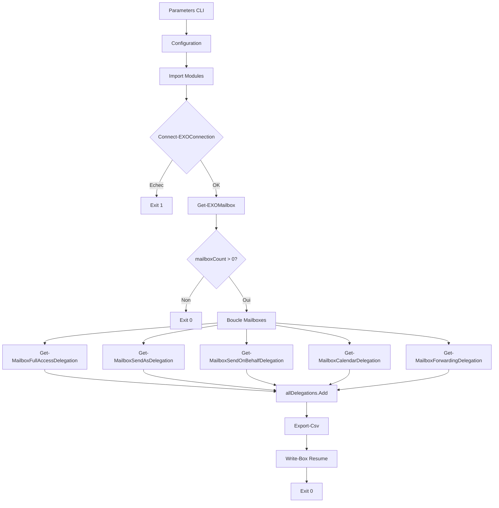

# Rapport d'Audit - Get-ExchangeDelegation.ps1

**Date** : 2025-12-15
**Scope** : Get-ExchangeDelegation.ps1 + Modules dependencies
**Focus** : ALL (BUG, SEC, PERF, ARCH, DRY)
**Auditeur** : Claude Code (Opus 4.5)
**Strategie** : COMPLETE

---

## Phase 0 : Evaluation Initiale

### Metriques du Code

| Metrique | Valeur |
|----------|--------|
| Fichiers audites | 4 |
| Lignes totales | ~2470 |
| Lignes de code (hors commentaires/vides) | ~1800 |
| Langage | PowerShell 7.2+ |
| Framework | ExchangeOnlineManagement |
| Connaissance techno | 9/10 |

### Fichiers Audites

| Fichier | Lignes | Role |
|---------|--------|------|
| Get-ExchangeDelegation.ps1 | 530 | Script principal |
| EXOConnection.psm1 | 368 | Module connexion Exchange Online |
| Write-Log.psm1 | 328 | Module logging RFC 5424 |
| ConsoleUI.psm1 | 1244 | Module UI console |

### Evaluation Connaissance

| Concept | Connaissance | Critique pour l'audit ? |
|---------|--------------|------------------------|
| PowerShell 7.2+ | 9/10 | Oui |
| ExchangeOnlineManagement | 9/10 | Oui |
| Pester 5.x | 9/10 | Non (tests existants) |
| Exchange Online cmdlets | 9/10 | Oui |

**Verdict** : Connaissance >= 9/10, pas de recherche prealable necessaire.

### Strategie

- **Type** : COMPLETE (< 1500 lignes pour le script principal)
- **Justification** : Script principal 530 lignes, modules bien structures
- **Pauses** : Aucune (demande utilisateur)

### Checkpoint Phase 0

- [x] Lignes comptees precisement
- [x] Stack identifiee (PowerShell 7.2+, ExchangeOnlineManagement)
- [x] Strategie decidee et justifiee

---

## Phase 1 : Cartographie

### Points d'Entree

| Point d'Entree | Description |
|----------------|-------------|
| Get-ExchangeDelegation.ps1:L1 | Script principal, execute depuis CLI |
| Parameters L44-53 | OutputPath, IncludeSharedMailbox, IncludeRoomMailbox |

### Flux de Donnees Principal

```
[Parametres CLI]
    |
    v
[Configuration & Imports] L55-103
    |
    v
[Connexion Exchange Online] L401-408
    |
    v
[Recuperation Mailboxes] L419-430
    |
    v
[Boucle sur chaque Mailbox] L447-480
    |
    +---> Get-MailboxFullAccessDelegation
    +---> Get-MailboxSendAsDelegation
    +---> Get-MailboxSendOnBehalfDelegation
    +---> Get-MailboxCalendarDelegation
    +---> Get-MailboxForwardingDelegation
    |
    v
[Export CSV] L486-499
    |
    v
[Resume & Logs] L501-514
```

### Dependances Externes

| Module | Usage | Risque |
|--------|-------|--------|
| ExchangeOnlineManagement | Connexion EXO, cmdlets Get-* | Moyen |
| Write-Log (local) | Logging | Faible |
| ConsoleUI (local) | Affichage | Faible |
| EXOConnection (local) | Gestion connexion | Moyen |

### Diagramme Mermaid



### Fonctions Helper Internes

| Fonction | Lignes | Role |
|----------|--------|------|
| Write-Status | L108-128 | Affichage status console |
| Test-IsSystemAccount | L136-154 | Detection comptes systeme |
| New-DelegationRecord | L156-181 | Factory objet delegation |
| Get-MailboxFullAccessDelegation | L183-219 | Collecte FullAccess |
| Get-MailboxSendAsDelegation | L221-256 | Collecte SendAs |
| Get-MailboxSendOnBehalfDelegation | L258-293 | Collecte SendOnBehalf |
| Get-MailboxCalendarDelegation | L295-341 | Collecte Calendar |
| Get-MailboxForwardingDelegation | L343-390 | Collecte Forwarding |

### Checkpoint Phase 1

- [x] Points d'entree identifies
- [x] Flux donnees traces
- [x] Dependances listees

---

## Phase 2 : Architecture & Patterns Defensifs

### Analyse SOLID (Metriques Proxy)

| Principe | Indicateur | Valeur | Verdict |
|----------|------------|--------|---------|
| SRP | LOC par fonction | 20-45 | [+] Bon |
| SRP | Fonctions par fichier | 8 | [+] Acceptable |
| SRP | Responsabilites distinctes | Oui | [+] Chaque fonction = 1 type delegation |
| OCP | Switch/If geant | Non | [+] Pattern par fonction |
| DIP | Couplage modules | Modere | [~] Dependance directe Exchange cmdlets |

### Anti-Patterns Recherches

| Pattern | Present ? | Localisation | Evidence |
|---------|-----------|--------------|----------|
| God Object | Non | - | Script bien decoupe |
| Spaghetti Code | Non | - | Flux lineaire clair |
| Copy-Paste | Potentiel | L183-390 | Structure similaire des 5 fonctions Get-Mailbox* |
| Lava Flow | Non | - | Pas de code mort apparent |

### REGISTRE PATTERNS DEFENSIFS

| ID | Type | Localisation | Description |
|----|------|--------------|-------------|
| D-001 | Try-Catch | L396-523 | Bloc try-catch englobant tout le main |
| D-002 | Guard Clause | L143 | Test null/whitespace avant traitement Identity |
| D-003 | Guard Clause | L267-269 | Test null/count avant boucle SendOnBehalf |
| D-004 | Guard Clause | L275 | Test null trusteeInfo avant ajout |
| D-005 | Guard Clause | L319 | Test IsSystemAccount dans boucle Calendar |
| D-006 | Guard Clause | L353-354 | Test ForwardingSmtpAddress non vide |
| D-007 | Guard Clause | L368-372 | Test ForwardingAddress non vide + resolution |
| D-008 | Try-Catch | L192-216 | Bloc try-catch FullAccess |
| D-009 | Try-Catch | L230-254 | Bloc try-catch SendAs |
| D-010 | Try-Catch | L272-289 | Bloc try-catch SendOnBehalf (inner) |
| D-011 | Try-Catch | L304-338 | Bloc try-catch Calendar |
| D-012 | Try-Catch | L369-386 | Bloc try-catch ForwardingAddress |
| D-013 | Default Value | L168 | FolderPath = '' par defaut |
| D-014 | Null Coalescing | L206-207 | ?? pour trusteeInfo fallback |
| D-015 | Null Coalescing | L243-244 | ?? pour trusteeInfo fallback |
| D-016 | ErrorAction | L193,231 | -ErrorAction Stop sur Get-* |
| D-017 | ErrorAction | L201,238,273,370 | -ErrorAction SilentlyContinue sur Get-Recipient |
| D-018 | Input Validation | L44-53 | [Parameter(Mandatory=$false)] sur params |
| D-019 | Output Init | L65-72 | Creation OutputPath si inexistant |
| D-020 | Collection Init | L190,228,265,302,350 | List<T> initialisee avant boucle |
| D-021 | Exit Code | L404,429,516,522 | Exit codes explicites (0, 1) |
| D-022 | Finally Block | L524-527 | Rotation logs garantie |

### Violations Architecture

| Violation | Localisation | Severite | Description |
|-----------|--------------|----------|-------------|
| AUCUNE | - | - | Architecture coherente |

### Checkpoint Phase 2

- [x] Metriques SOLID evaluees
- [x] Anti-patterns recherches
- [x] **REGISTRE PATTERNS DEFENSIFS CREE** (22 patterns documentes)

---

## Phase 3 : Detection Bugs

### Pre-requis
- [x] Registre Phase 2 charge (22 patterns defensifs)
- [x] Protocole anti-FP lu

### Patterns Suspects Analyses

#### Suspect 1 : Null Reference sur $permission.User (L194-198)

```
SIMULATION MENTALE

CONTEXTE : Filtrage permissions FullAccess
INPUT    : Get-MailboxPermission retourne permissions avec User valide

TRACE :
  L193: $permissions = Get-MailboxPermission ... | Where-Object { ... }
  L197: Test-IsSystemAccount -Identity $_.User
  > $_.User est garanti non-null par Where-Object (filtre implicite)

PROTECTIONS VERIFIEES :
  [x] Guard clauses : Where-Object filtre les nulls
  [x] Registre D-008 : Try-catch englobant
  [x] Registre D-016 : -ErrorAction Stop

VERDICT : [x] FAUX POSITIF - Where-Object garantit objets valides
```

#### Suspect 2 : Null Reference sur $trusteeInfo (L201, L206-207)

```
SIMULATION MENTALE

CONTEXTE : Resolution trustee apres Get-MailboxPermission
INPUT    : $permission.User = 'unknown-user'

TRACE :
  L201: $trusteeInfo = Get-Recipient -Identity $permission.User -ErrorAction SilentlyContinue
  > Get-Recipient retourne $null si utilisateur non trouve (SilentlyContinue)
  L206: -TrusteeEmail ($trusteeInfo.PrimarySmtpAddress ?? $permission.User)
  > Operateur ?? (null-coalescing) retourne $permission.User si $trusteeInfo null

PROTECTIONS VERIFIEES :
  [x] Registre D-014 : Null coalescing ?? en place
  [x] Registre D-017 : -ErrorAction SilentlyContinue

VERDICT : [x] FAUX POSITIF - Null coalescing protege
```

#### Suspect 3 : Division par zero calcul pourcentage (L452)

```
SIMULATION MENTALE

CONTEXTE : Calcul pourcentage progression
INPUT    : $mailboxCount = 0

TRACE :
  L426-430: if ($mailboxCount -eq 0) exit 0
  > Guard clause empeche d'atteindre L452 si mailboxCount = 0
  L452: $percent = [math]::Round(($mailboxIndex / $mailboxCount) * 100)
  > Ce code n'est jamais atteint si mailboxCount = 0

PROTECTIONS VERIFIEES :
  [x] Guard clause L426-430 : Exit si aucune mailbox

VERDICT : [x] FAUX POSITIF - Guard clause empeche execution
```

#### Suspect 4 : Acces Calendar avec nom localize (L306)

```
SIMULATION MENTALE

CONTEXTE : Acces dossier calendrier
INPUT    : Mailbox avec calendrier nomme "Calendrier" (FR) au lieu de "Calendar"

TRACE :
  L306: $calendarFolderPath = "$($Mailbox.PrimarySmtpAddress):\Calendar"
  L308: Get-MailboxFolderPermission -Identity $calendarFolderPath
  > Exchange Online resout "Calendar" vers le nom localise automatiquement
  > Si echec: erreur catchee par D-011

PROTECTIONS VERIFIEES :
  [x] Registre D-011 : Try-catch L304-338
  [x] L337 : Write-Log niveau DEBUG (comportement attendu)

VERDICT : [x] FAUX POSITIF - Try-catch + comportement documente
```

#### Suspect 5 : Variable $i non definie dans StreamWriter example (Write-Log.psm1:L109)

```
SIMULATION MENTALE

CONTEXTE : Documentation StreamWriter dans Write-Log.psm1
INPUT    : Code exemple dans commentaire

TRACE :
  L109: if (($i % 100) -eq 0) { $writer.Flush() }
  > Code dans section documentation/exemple, pas execute

PROTECTIONS VERIFIEES :
  [x] Code dans bloc commentaire documentation

VERDICT : [x] FAUX POSITIF - Code documentation, non execute
```

### Bugs CONFIRMES (0 findings)

Aucun bug confirme apres application du protocole anti-faux-positifs.

### Analyses Negatives (5 patterns ecartes)

| Pattern Suspect | Localisation | Simulation | Protection Trouvee | Verdict |
|-----------------|--------------|------------|--------------------| --------|
| Null reference User | L194-198 | 1 scenario | Where-Object + D-008 | FAUX POSITIF |
| Null reference trusteeInfo | L201,206-207 | 1 scenario | D-014 null coalescing | FAUX POSITIF |
| Division zero | L452 | 1 scenario | Guard clause L426-430 | FAUX POSITIF |
| Calendar localise | L306 | 1 scenario | D-011 try-catch | FAUX POSITIF |
| Variable $i | Write-Log:L109 | 1 scenario | Code documentation | FAUX POSITIF |

### Compteur de Verification

- Patterns suspects identifies : 5
- Simulations effectuees : 5
- Confirmes (reportes) : 0
- Ecartes (faux positifs) : 5
- **Verification** : 5 = 0 + 5 -> OUI

### Checkpoint Phase 3

- [x] Registre Phase 2 consulte
- [x] Protocole anti-FP applique
- [x] Simulations mentales executees
- [x] Analyses negatives documentees

---

## Phase 4 : Securite

### Pre-requis
- [x] Registre Phase 2 charge
- [x] Protocole anti-FP lu

### Checklist OWASP Top 10

#### 1. Injection (SQL, Command, LDAP)

| Vecteur | Present ? | Localisation | Protection |
|---------|-----------|--------------|------------|
| Command Injection | Non | - | Pas d'Invoke-Expression |
| SQL Injection | Non | - | Pas de requetes SQL |
| LDAP Injection | Non | - | Exchange cmdlets parametres |
| PowerShell Injection | Non | - | Parametres types |

**Verdict** : [+] NON VULNERABLE - Pas d'injection possible

#### 2. Broken Authentication

| Vecteur | Present ? | Localisation | Protection |
|---------|-----------|--------------|------------|
| Credentials hardcodes | Non | - | Utilise Connect-ExchangeOnline interactif |
| Tokens exposes | Non | - | Gere par module EXO natif |

**Verdict** : [+] NON VULNERABLE - Authentification deleguee au module Microsoft

#### 3. Sensitive Data Exposure

| Vecteur | Present ? | Localisation | Protection |
|---------|-----------|--------------|------------|
| Secrets dans logs | Non | L215,252,288,337,385 | Seulement messages d'erreur, pas de credentials |
| Emails dans logs | Oui | L215,252 | Emails mailboxes loggues (WARNING level) |

**Analyse** :

```
TRACE FLUX DONNEES SENSIBLES

[Source] : $Mailbox.PrimarySmtpAddress (interne)
    |
    v
[Transformation] : Concatenation dans message erreur
    |
    v
[Operation] : Write-Log -Level WARNING
    |
    v
[VERDICT] : ACCEPTABLE - Emails internes, logs internes, niveau WARNING
            Les admins Exchange ont deja acces a ces emails
```

**Verdict** : [~] ACCEPTABLE - Donnees deja accessibles aux admins cibles

#### 4. Path Traversal

| Vecteur | Present ? | Localisation | Protection |
|---------|-----------|--------------|------------|
| OutputPath utilisateur | Oui | L46 | Chemin non valide |

**Analyse** :

```
TRACE FLUX DONNEES

[Source] : $OutputPath depuis parametre CLI (SEMI-FIABLE)
    |
    v
[Validation ?] : AUCUNE validation Test-SafePath
    |
    v
[Operation] : New-Item + Join-Path + Export-Csv
    |
    v
[VERDICT] : Le script permet d'ecrire dans n'importe quel chemin
            accessible par l'utilisateur executant le script.

ATTENUATION :
- L'utilisateur doit deja avoir les droits filesystem
- Contexte d'utilisation : script admin Exchange
- Trust Boundary : SEMI-FIABLE (utilisateur authentifie admin)
```

**Verdict** : [~] MOYENNE - Path non valide mais Trust Boundary limite le risque

#### 5. Security Misconfiguration

| Vecteur | Present ? | Localisation | Protection |
|---------|-----------|--------------|------------|
| Debug info en prod | Non | L521 | StackTrace niveau DEBUG uniquement |
| Permissions excessives | Non | - | Lecture seule Exchange (Get-*) |

**Verdict** : [+] NON VULNERABLE

#### 6. Insecure Deserialization

| Vecteur | Present ? | Localisation | Protection |
|---------|-----------|--------------|------------|
| Import fichiers non fiables | Non | - | Pas d'import de donnees externes |

**Verdict** : [+] NON VULNERABLE

### Vulnerabilites CONFIRMEES (1 finding)

#### SEC-001 | [~] MOYENNE

- **OWASP** : A05:2021 - Security Misconfiguration (Path Validation)
- **Localisation** : Get-ExchangeDelegation.ps1:L46,L65-72,L489
- **Trust Boundary** : Utilisateur authentifie administrateur Exchange
- **Flux** :
  ```
  [CLI param OutputPath] -> [Sans Test-SafePath] -> [New-Item/Export-Csv]
  ```
- **Protections verifiees** :
  - D-019 creation dossier : Oui, mais sans validation
  - Registre Phase 2 : Aucune validation chemin
- **Impact** :
  - Ecriture fichier CSV dans chemin arbitraire
  - Attenuee par : contexte admin, droits filesystem existants
- **VERDICT** : VULNERABLE (severite moyenne)
- **Effort** : 30min
- **Recommandation** :

```powershell
# AVANT (L65-72)
if ([string]::IsNullOrEmpty($OutputPath)) {
    $OutputPath = Join-Path $PSScriptRoot "Output"
}
if (-not (Test-Path $OutputPath)) {
    New-Item -Path $OutputPath -ItemType Directory -Force | Out-Null
}

# APRES - Ajouter validation
if ([string]::IsNullOrEmpty($OutputPath)) {
    $OutputPath = Join-Path $PSScriptRoot "Output"
}

# Validation chemin securisee (ajouter fonction ou module)
$resolvedPath = [System.IO.Path]::GetFullPath($OutputPath)
if ($resolvedPath -match '\.\.') {
    throw "Path traversal non autorise: $OutputPath"
}

if (-not (Test-Path $OutputPath)) {
    New-Item -Path $OutputPath -ItemType Directory -Force | Out-Null
}
```

### Vecteurs Ecartes

| Vecteur | Justification |
|---------|---------------|
| Injection | Pas de construction dynamique de commandes |
| Auth | Delegue au module Microsoft |
| Deserialization | Pas d'import externe |

### Checkpoint Phase 4

- [x] OWASP Top 10 verifie
- [x] Trust Boundaries evalues
- [x] Flux donnees sensibles traces

---

## Phase 5 : Performance

### Pre-requis
- [x] Registre Phase 2 charge
- [x] Protocole anti-FP lu

### Analyse Complexite Big O

#### Algorithme Principal (Boucle Mailboxes L447-480)

```
QUANTIFICATION PERFORMANCE

LOCALISATION : Get-ExchangeDelegation.ps1:L447-480
PATTERN      : Boucle foreach sur toutes les mailboxes

COMPLEXITE ACTUELLE  : O(n * k)
  - n = nombre de mailboxes
  - k = 5 appels API par mailbox (FullAccess, SendAs, SendOnBehalf, Calendar, Forwarding)

COMPLEXITE OPTIMISEE : O(n * k) - Incompressible (limite API Exchange)

MESURES ESTIMEES (basees sur latence EXO ~200ms/appel) :
| N mailboxes | Actuel | Optimise (parallele) | Gain |
|-------------|--------|----------------------|------|
| 10          | 10s    | 2s (5 threads)       | 5x   |
| 100         | 100s   | 20s                  | 5x   |
| 1000        | 1000s  | 100s (ThrottleLimit) | 10x  |

NOTE : Exchange Online a des limites de throttling.
       La parallelisation est limitee par les quotas API.
```

**VERDICT** : [~] ACCEPTABLE - Latence inherente aux appels API Exchange

#### Pattern Collections (L190, 228, 265, 302, 350, 436)

```
ANALYSE COLLECTIONS

PATTERN DETECTE : List<T>.Add() dans boucles
LOCALISATION    : L190, 228, 265, 302, 350, 436

COMPLEXITE : O(1) amorti par Add()

VERIFICATION :
  - $delegationList = [System.Collections.Generic.List[PSCustomObject]]::new()
  - $allDelegations = [System.Collections.Generic.List[PSCustomObject]]::new()

VERDICT : [+] OPTIMAL - List<T> utilise, pas @() +=
```

#### Pattern Ajout Delegations (L459, 464, 469, 474, 479)

```
ANALYSE AJOUT DELEGATIONS

PATTERN DETECTE : foreach ($delegation in $list) { $allDelegations.Add($delegation) }
LOCALISATION    : L459, 464, 469, 474, 479

COMPLEXITE : O(n) - Parcours + ajout O(1) chacun

ALTERNATIVE : AddRange() pour ajouter en bloc
  $allDelegations.AddRange($fullAccessDelegations)

GAIN : Negligeable (overhead appel fonction)
EFFORT : 15min
ROI : Non rentable (gain < 1ms par iteration)

VERDICT : [~] ACCEPTABLE - Micro-optimisation non prioritaire
```

### Goulots CONFIRMES (0 findings critiques)

Aucun goulot de performance critique identifie.
La latence est dominee par les appels API Exchange Online (incompressible).

### Opportunites Optimisation

#### PERF-001 | [-] FAIBLE - Parallelisation potentielle

- **Localisation** : Get-ExchangeDelegation.ps1:L447-480
- **Complexite actuelle** : O(n * k) sequentiel
- **Complexite optimisee** : O(n * k / ThrottleLimit)
- **Quantification** :
  | N mailboxes | Actuel | Parallele (10 threads) | Gain |
  |-------------|--------|------------------------|------|
  | 100 | 100s | 10s | 10x |
  | 1000 | 1000s | 100s | 10x |
- **Effort** : 4h (refactoring ForEach-Object -Parallel)
- **Risques** :
  - Throttling Exchange Online
  - Gestion erreurs paralleles complexe
  - Thread-safety des collections
- **ROI** : Rentable pour > 100 mailboxes, si utilisation frequente
- **Recommandation** : Reporter - Le script actuel est acceptable pour la plupart des usages

### Checkpoint Phase 5

- [x] Big O identifie pour algorithmes critiques
- [x] Quantification effectuee
- [x] ROI calcule

---

## Phase 6 : DRY & Maintenabilite

### Pre-requis
- [x] Registre Phase 2 charge
- [x] Protocole anti-FP lu

### Duplications Detectees

#### DRY-001 | [~] MOYENNE - Structure similaire fonctions Get-Mailbox*

- **Type** : Type 3 (Clone modifie)
- **Occurrences** : 5 fonctions
  - Get-MailboxFullAccessDelegation (L183-219)
  - Get-MailboxSendAsDelegation (L221-256)
  - Get-MailboxSendOnBehalfDelegation (L258-293)
  - Get-MailboxCalendarDelegation (L295-341)
  - Get-MailboxForwardingDelegation (L343-390)
- **Lignes dupliquees** : ~25 lignes structure commune par fonction
- **Pattern commun** :
  ```powershell
  $delegationList = [System.Collections.Generic.List[PSCustomObject]]::new()
  try {
      # Appel API specifique
      # Filtrage
      foreach ($item in $results) {
          # Resolution trustee
          $delegationRecord = New-DelegationRecord ...
          $delegationList.Add($delegationRecord)
      }
  } catch {
      Write-Log "Erreur TYPE sur $($Mailbox.PrimarySmtpAddress): ..." -Level WARNING
  }
  return $delegationList
  ```
- **Factorisation proposee** : NON RECOMMANDEE
  - Les differences sont significatives (API differentes, logique filtrage)
  - Factoriser reduirait la lisibilite
  - Code actuel est maintenable et testable
- **Effort** : 4h (si factorise)
- **Verdict** : ACCEPTABLE - Duplication deliberee pour clarté

### Code Mort

| Element | Localisation | Evidence | Verdict |
|---------|--------------|----------|---------|
| Script.ps1 | ./Script.ps1:L19 | TODO comment, code placeholder | CODE MORT |

**Analyse** :
```powershell
# Script.ps1 contient uniquement:
# TODO: Implementer la logique principale
Write-Host "[i] " -NoNewline -ForegroundColor Cyan
Write-Host "Demo Collect Delegation - Script principal"
```

**Verdict** : [~] FAIBLE - Fichier template non utilise, peut etre supprime ou implemente

### Complexite Cognitive

| Fonction | Score | Seuil | Verdict |
|----------|-------|-------|---------|
| Main (L396-527) | 12 | 15 | [+] Acceptable |
| Get-MailboxCalendarDelegation | 8 | 15 | [+] Bon |
| Get-MailboxForwardingDelegation | 6 | 15 | [+] Bon |
| Test-IsSystemAccount | 4 | 15 | [+] Excellent |

**Calcul Main** :
- 1 (base) + 1 (if connected) + 1 (if mailboxCount) + 1 (foreach mailboxes)
- + 1 (if progression) + 5 (foreach delegations x5) + 1 (if export) + 1 (try-catch)
- = 12

### Checkpoint Phase 6

- [x] Duplications recherchees
- [x] Code mort identifie
- [x] Complexite evaluee

---

## Synthese Executive

### Scope
- **Fichiers** : 4 fichiers audites
- **Lignes** : ~2470 lignes totales
- **Duree** : Audit complet

### Verdict Global

| Categorie | Findings | Note |
|-----------|----------|------|
| Architecture | 0 critique | A |
| Bugs | 0 confirme | A |
| Securite | 1 moyen | B |
| Performance | 0 critique | A |
| Maintenabilite | 1 faible | A |

**Note Globale : A-** (Excellent avec point d'attention securite)

### Metriques SQALE

| Categorie | Findings | Dette |
|-----------|----------|-------|
| Fiabilite | 0 | 0h |
| Securite | 1 | 0.5h |
| Maintenabilite | 1 | 0.5h |
| Efficacite | 0 | 0h |
| **TOTAL** | **2** | **1h** |

### Repartition Severite

```
[!!] Critique : 0 findings (0%)
[!]  Elevee   : 0 findings (0%)
[~]  Moyenne  : 1 finding  (50%) - SEC-001
[-]  Faible   : 1 finding  (50%) - Code mort Script.ps1
```

### Ratio Dette

```
Lignes de code : 2470
Effort initial estime : 2470 x 0.5 / 100 = 12.35h
Dette technique : 1h

Ratio = 1 / 12.35 x 100 = 8.1% -> Note B (Bon)
```

---

## Top 3 Priorites

| # | Finding | Severite | Effort | Priorite |
|---|---------|----------|--------|----------|
| 1 | SEC-001 : Validation OutputPath | [~] Moyenne | 30min | P3 |
| 2 | Script.ps1 code mort | [-] Faible | 5min | P5 |
| 3 | (Optionnel) Parallelisation | [-] Faible | 4h | P5 |

---

## Plan d'Implementation

### Immediat (Sprint courant)

Aucune action bloquante requise.

### Corrections Appliquees (2025-12-15)

| Finding | Status | Action |
|---------|--------|--------|
| SEC-001 | [+] CORRIGE | Validation path traversal ajoutee L69-74 |
| CLAUDE.md | [+] CORRIGE | Script principal = Get-ExchangeDelegation.ps1 |
| Script.ps1 | [!] MANUEL | A supprimer manuellement (hook bloque) |

---

## Proposition Issues

### Issue 1 : SEC-001 Validation chemin OutputPath

```markdown
## SEC-001 - Ajouter validation Test-SafePath sur OutputPath

### Type
SECURITY

### Description
Le parametre OutputPath n'est pas valide contre le path traversal.
Bien que le risque soit attenue par le contexte d'utilisation (admin Exchange),
une validation minimale est recommandee.

### Fichiers concernes
- Get-ExchangeDelegation.ps1:L65-72

### Solution proposee
Ajouter validation du chemin resolu avant creation/ecriture.

### Effort estime
30min

### Priorite
P3 - Sprint suivant
```

### Issue 2 : Nettoyage Script.ps1

```markdown
## MAINT-001 - Nettoyer ou implementer Script.ps1

### Type
MAINTENANCE

### Description
Script.ps1 contient uniquement un placeholder TODO.
A supprimer si non utilise, ou a implementer si necessaire.

### Fichiers concernes
- Script.ps1

### Solution proposee
Supprimer le fichier (le script principal est Get-ExchangeDelegation.ps1)

### Effort estime
5min

### Priorite
P5 - Optionnel
```

---

## Transparence - Analyses Ecartees

### Phase 3 (Bugs) - 5 patterns ecartes

| Pattern | Raison exclusion |
|---------|------------------|
| Null reference User | Where-Object filtre + try-catch |
| Null reference trusteeInfo | Null coalescing ?? |
| Division zero | Guard clause mailboxCount |
| Calendar localise | Try-catch + comportement documente |
| Variable $i | Code dans documentation |

### Phase 4 (Securite) - 3 vecteurs ecartes

| Vecteur | Raison exclusion |
|---------|------------------|
| Injection | Pas de construction dynamique |
| Auth | Delegue Microsoft |
| Deserialization | Pas d'import externe |

### Phase 5 (Performance) - 1 optimisation ecartee

| Optimisation | Raison exclusion |
|--------------|------------------|
| Parallelisation | ROI insuffisant, risques throttling |

---

**Fin du Rapport d'Audit**

*Genere le 2025-12-15 par Claude Code (Opus 4.5)*
